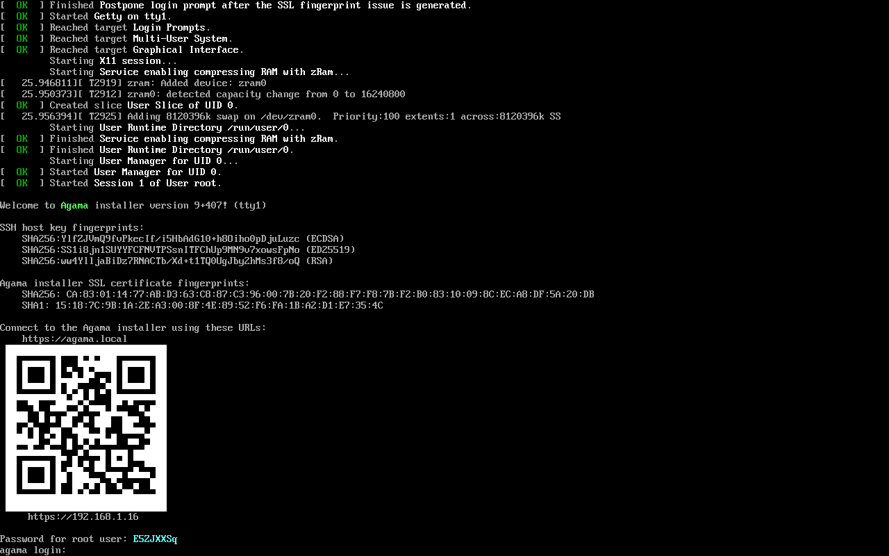
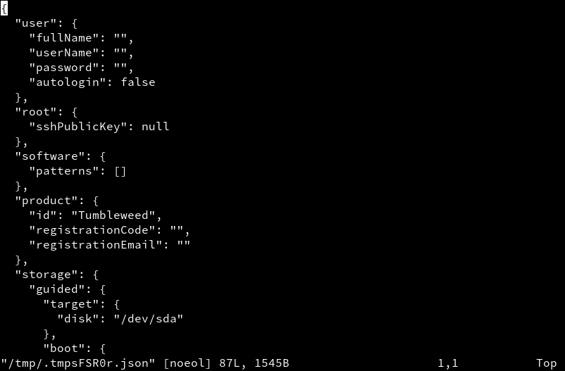
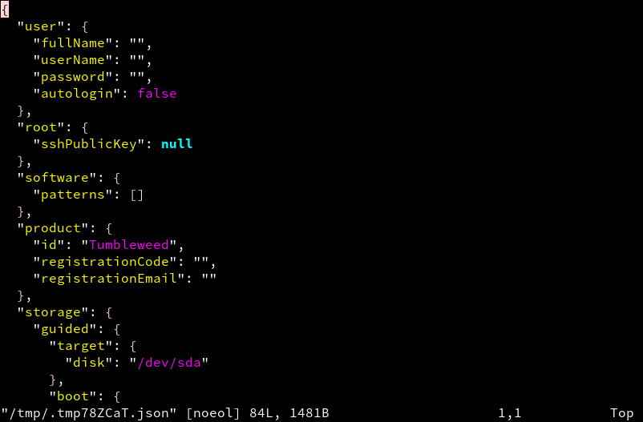
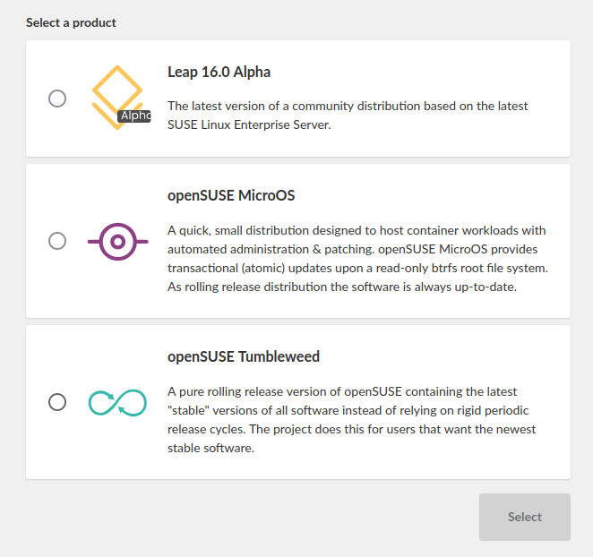

As you can see we have a new place for our Agama blog! So let's start with announcing the Agama
version 10 release at this new place! :tada:

{/* truncate */}

We released the Agama version 10 quite some time ago, but we did not announce it yet because of lack
of time. So if you downloaded the Agama installer recently then you are already using this new
version.

We decided to separate the Agama blog posts from the YaST blog as those tools are quite different
and to avoid confusion about what is what in the future. So welcome at the new blogging place for
Agama!

## QR codes with Agama URL {#qr}

Let's start with some cool and fancy stuff! :smiley:

We found out that it is possible to display QR code even on a Linux text console. As QR codes can
contain an URL then why not use it also for Agama? If you use a mobile phone for connecting to the
running Agama instance this makes the process much easier.



The QR code is not displayed on standard 80x25 or 80x24 terminals because there is not enough space,
it is displayed only on bigger screens.

## Syntax highlighting {#highlighting}

You can edit the current Agama configuration in a text editor using the `agama config edit` command.
This opens a text editor (Vim by default) with the current Agama configuration in the JSON format.

Previously the configuration was displayed as a plain text file without any syntax highlighting. Now
you can enjoy JSON syntax highlighting which makes editing a bit more pleasant.

import SmallImageBox from "@site/src/components/SmallImageBox";

<SmallImageBox>
  
  
</SmallImageBox>

You can use any another text editor for editing the configuration but as the Live ISO content is
limited it only offers Joe as an alternative.

```bash
EDITOR=joe agama config edit
```

:::tip

You can install more editors using the usual `zypper install` command. But be careful, see the
<a href="#free-space-warning">warning</a> below.

:::

## Product selection {#products}

We changed a bit the list of products which can be installed with Agama. Since version 10 it is
possible to install openSUSE Leap 16.0 Alpha. We also created a SLES 16 flavor but for now it is not
available for public.

The product selection dialog now contains the product icons so the product selection should be more
intuitive. Many thanks to [Luboš Kocman](https://github.com/lkocman) for implementing this!



## Improvements in storage {#storage}

Agama now supports creating LVM volume groups, logical volumes, thin pools and thin logical volumes
in automatic installations. Reusing volume groups or logical volumes is not supported yet.

Also the existing partitions can be deleted automatically. There are two options, unconditional
delete and delete only if needed. The first option always deletes the specified partition, the
second option deletes it only when there is not enough space to create the needed partitions.

Always delete a partition:

```json
{
  "search": "/dev/vda1",
  "delete": true
}
```

Delete a partition only when needed:

```json
{
  "search": "/dev/vda1",
  "deleteIfNeeded": true
}
```

See more details in the [auto_storage](
https://github.com/openSUSE/agama/blob/master/doc/auto_storage.md) documentation.

## Installation repository URL {#installation-url}

By default Agama installs the packages from the repositories specified in the product configuration.
Those normally point to the official SUSE/openSUSE installation repositories.

But for testing purposes, especially in the openQA tests, you might need to install the packages
from some testing or staging repository to test the latest versions which are not published in those
official repositories yet.

From now Agama supports using the `agama.install_url` boot parameter for overriding the default
installation repositories. You can use multiple URLs separated by comma:

```bash
agama.install_url=https://example.com/1,https://example.com/2
```

## Internal changes {#internal}

There are lots of internal changes in Agama so we mention here only the most important ones.

### Typescript support {#typescript}

The Agama web UI started in plain Javascript. But that is quite fragile, you can easily by mistake
pass wrong arguments to a function or call a missing method on an object. Such a mistake would cause
a crash. The [Typescript](https://www.typescriptlang.org/) language avoids all these kinds of
problems.

Recently we added support for writing parts of the web UI in Typescript. We do not plan to do any
big refactoring at once, the files will be gradually switched from Javascript to Typescript when
touching them.

### TanStack Query state management {#state-management}

In the web frontend we started using the [TanStack Query](https://tanstack.com/query/latest)
framework for the state management. It provides a mechanism based on promises to fetch or update the
state automatically. It takes care of caching, re-fetching, error handling, etc. so you do not have
to implement these features by yourselves.

### Live ISO free space {#free-space}

In Agama 9 we [fixed locking](2024-06-28-agama-9.mdx#live-iso) the package management system so now
you can easily install additional packages into the Live ISO system. But it turned out that the
available space for installing new packages was just about 0.5GB. That was not much if you wanted to
install some big debugging packages or use your own compiled Agama HTTP server (the Rust binaries
with debug information can be huge).

<a id="free-space-warning"></a>
In Agama 10 we increased the available space to about 3.5GB which should be enough in most cases.

:::warning

Because the Live ISO system runs in a RAM disk then any changes to the file system, like installing
packages or editing the files, will take the RAM space. Make sure your system has enough RAM for
storing the new or updated files otherwise the Agama installer might crash later!

:::

Technically it was a bit tricky because when building the ISO image Kiwi computes the file system
size automatically and does not allow to set a custom value. As a workaround we create a big [sparse
file](https://en.wikipedia.org/wiki/Sparse_file) during the image build which just takes a tiny
fraction of its real size so the final ISO size is basically the same. To free even some more space
the file is automatically deleted when booting the Live ISO.

### Puppeteer {#puppeteer}

For writing the integration tests we originally used the [Playwright](https://playwright.dev/)
framework. It works nice, it has great features, but there is one major problem for us: it does not
work with original unmodified Firefox browser. For running the tests it downloads a specially
patched Firefox binary. That means we cannot use it for testing Agama because we need to test it
with the Firefox version we have in our distribution.

Unfortunately the Chromium browser which works fine unmodified cannot be compiled on S390 and
PowerPC architectures. That means we would not be able to test Agama in SUSE Linux Enterprise on
these architectures.

That is why we replaced Playwright with the [Puppeteer](https://pptr.dev/) framework in Agama 10.

### HTTP backend in CLI {#http-cli}

When moving to the new HTTP-based architecture without Cockpit we took some shortcuts. One of them
was not using HTTP clients in the command-line interface (CLI) but using the old DBus API.

This was fixed in Agama 10 so now also the command-line now uses the same HTTP API as the web
frontend. This should avoid possible inconsistencies between those two user interfaces.

## Conclusion {#conclusion}

Your contributions and opinions are important sources for feedback about the new release. So don't
hesitate to contact the YaST team at the [YaST Development mailing
list](https://lists.opensuse.org/archives/list/yast-devel@lists.opensuse.org/), our `#yast` channel
at [Libera.chat](https://libera.chat/) or the [Agama project at
GitHub](https://github.com/agama-project/agama) if you find any problem or have an idea for
improvement.

Have a lot of fun!
