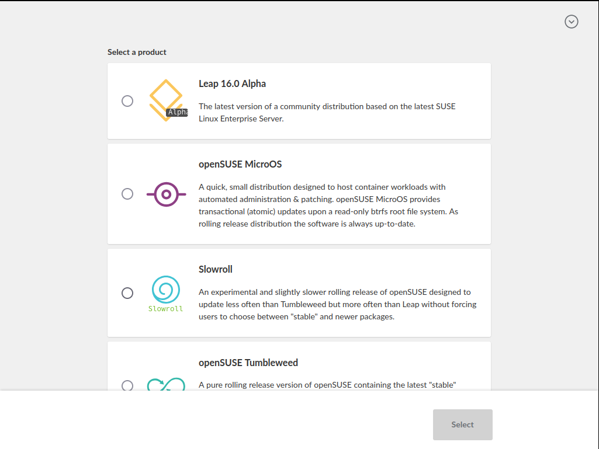
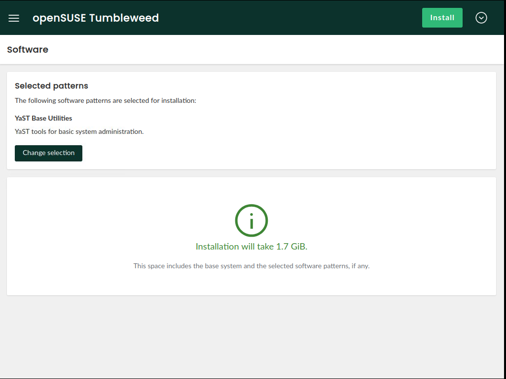
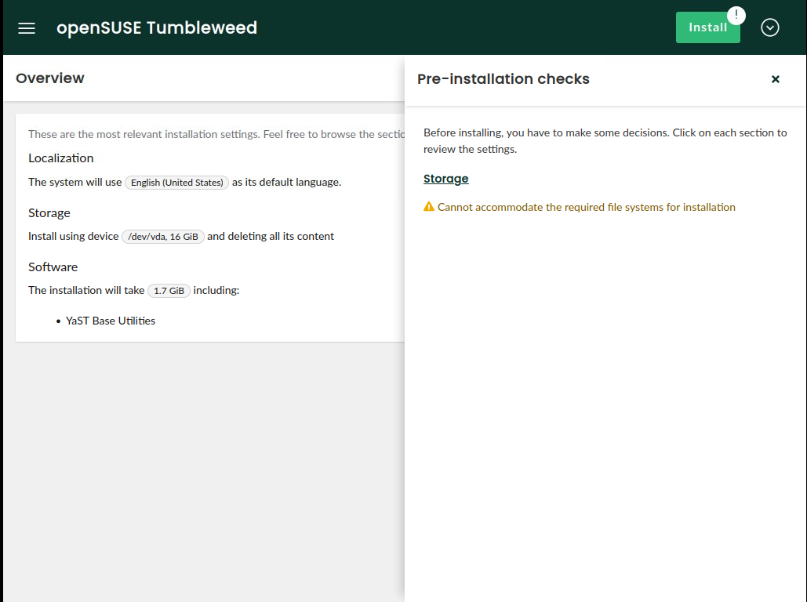
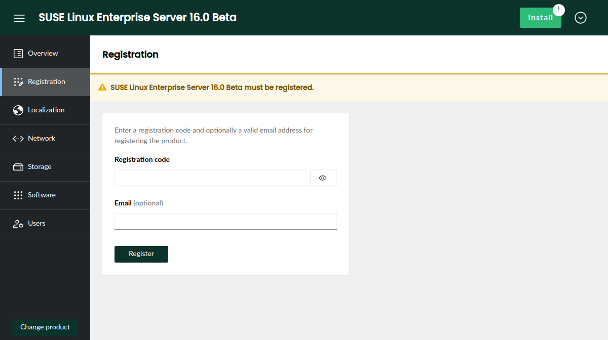
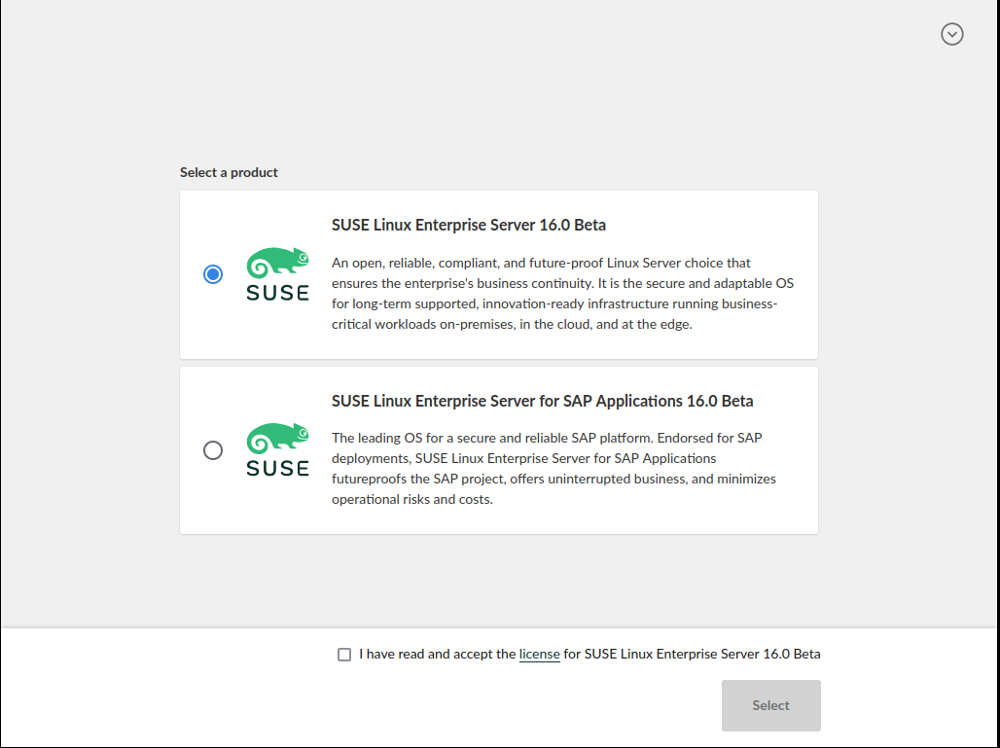

The first beta versions of SUSE Linux Enterprise Server 16 are almost around the corner and openSUSE
Leap 16 is already at [alpha phase](https://en.opensuse.org/openSUSE:Roadmap). So the YaST Team (or
should we already say the Agama Team?) has focused during the last couple of weeks on providing a
better installation experience for both families of distributions. Agama 11 is the result, so let's
see what's new on this release.

{/* truncate */}

Bear in mind that some minor revisions of Agama 11 could be released in the following
days to correct issues detected during the testing of SLES 16 Beta and openSUSE Leap 16 Alpha. We
will update this blog post if any of those changes affect significantly any of the features listed
below.

## Agama can install Slowroll now {#slowroll}

Let's start welcoming a new member to the family of operating systems Agama can install. Thanks to
[WesFun](https://github.com/WesfunOfficial) now it is possible to select [openSUSE
Slowroll](https://en.opensuse.org/Portal:Slowroll) when using the Agama testing iso for openSUSE.



Keep the contributions coming!

## Changes in the web interface {#webui}

Agama 11 also comes with a small reorganization of the workflow of the web interface. In previous
versions, it was always necessary to visit the "Users" section to configure the root authentication
and then go back to the "Overview" page in order to proceed with the installation. That happened
because authentication is the only aspect of the system configuration for which Agama cannot infer
any reasonable setup. You surely don't want Agama to choose a root password for you!

Starting with Agama 11, a screen to configure the root authentication is presented to the user right
away after selecting the operating system to install.


After configuring the root password the user lands in the main Agama screen, where the general
layout has been reorganized to ensure the "install" button is always accessible from all sections of
the interface.



Additionally, the new install button can show a exclamation mark if there are issues preventing the
installation and provides a summary of those issues pointing to the corresponding section that can
be used to solve the situation.



The changes in the web interface go far beyond the new location of the install button. We encourage
you to explore yourself to find all the small improvements!

## Product registration {#registration}

As you all know, one of the main goals of Agama is to become the official installer for SUSE Linux
Enterprise Server 16. The development of that operating system, and its sibling product SLES for SAP
Application, is progressing nicely with some preliminary versions being already available to SUSE
Partners.

Installing those systems requires the user to register in order to gain access to the repositories.
Agama can detect whether registration is necessary and then offer a convenient user interface for
the process, as seen below.



Of course, this feature is irrelevant for openSUSE users since the openSUSE repositories are fully
public and they will always be.

## License agreement {#license}

Another difference between openSUSE and a corporate distribution like SLES is that users needs to
explicitly accept a license agreement to use the latter. In the case of the Agama web interface,
that means presenting the license as soon as possible in the process. Thus, the corresponding
EULA must be accepted already when selecting any of the products that require to do so.



Of course, the screenshot above belongs to a SLES installation media and openSUSE users will not
notice this new feature.

## Allow remote usage of the command-line interface {#remotecli}

As convenient as an interactive installation with the web interface can be, you know that the
command-line interface and the unattended installation process are also first-class citizen for
Agama. Thus, they also received some love on this release.

Agama's CLI (command-line interface) offers an alternative way to control the installation process
useful in various situations like installing in machines that cannot serve the web interface (eg.
due to limited resources), using scripts and other automation techniques or simply when the user
prefers good old terminal over graphical interfaces. Now Agama's CLI offers a new global parameter
`--api` that allows to run the tool (and any script based on it) on a different machine from that
being effectively installed. Bear in mind the new argument is still not honored by all Agama
subcommands. Support for it will be extended on subsequent releases.

## Scripting support in unattended installation {#scripting}

Years of AutoYaST experience has taught us that, no matter how flexible an installer is, users of
unattended installations always want to go further. And embedding scripting capabilities into the
installer configuration has turned to be an awesome tool for that. So, similar to AutoYaST profiles,
Agama configuration files now offer a "scripts" section. It makes possible to run scripts both
before and after the installation process and also on the first boot of the new system.

Below you can see a [Jsonnet](https://jsonnet.org/) configuration file for Agama including scripts.
Note it would also work with plain JSON but, since that format does not support multi-line strings,
each script would need to be provided as a long string with "\n" marking the end of each line (not
so nice for a blog post :wink:).

```jsonnet
{
  scripts: {
    pre: [
      {
        name: "activate-multipath",
        body: |||
          #!/usr/bin/bash
          systemctl start multipathd.socket multipathd.service
        |||
      }
    ],
    post: [
      {
        name: "enable-sshd",
        chroot: true,
        body: |||
          #!/usr/bin/bash
          systemctl enable sshd.service
        |||
      }
    ],
    init: [
      {
        name: "run-ansible",
        url: "https://192.168.1.1/provisioning.sh"
      }
    ]
  }
}
```

For more details see the [scripts
section](https://agama-project.github.io/docs/user/unattended/scripts) of the Agama documentation
site.

## Storage management for unattended installation {#storage}

The Agama configuration format offers a very convenient and powerful approach to configure the
storage setup of the new system, way more consistent and concise that the corresponding 
`<partitioning>` section of the AutoYaST profile (which is still fully supported for migration
purposes).

Agama 11 adds the possibility to define the physical volumes of an LVM volume group by simply
specifying the disk (or disks) that will be used as a base for the LVM. Agama will take care of
creating all the needed partitions, honoring any other aspect of the configuration in the process.
Find a more detailed explanation with examples at the [corresponding
section](https://agama-project.github.io/docs/user/unattended/storage#generating-physical-volumes)
of the Agama documentation.

On the other hand, now it is possible to specify TPM-based unlocking of the encrypted devices as
part of the Agama storage configuration. Thus, users of unattended installation can also deploy
fully encrypted systems based on TPMv2.

## Automatic generation of documentation and shell completion {#generate}

A comprehensive and up-to-date documentation is key for a project like Agama, especially for users
of the command-line interface and the HTTP API. And the best way to ensure the documentation is
always in sync with the current version of Agama is to generate it automagically from the source
code.

In the case of the CLI, the manual pages, its Markdown variant and also the files needed for
[shell completion](https://en.wikipedia.org/wiki/Command-line_completion) are all generated from
sources. You can see the always current result of the Markdown version at the [corresponding
section](https://agama-project.github.io/docs/user/cli) of the Agama web page.

The HTTP API is also automatically documented via an [OpenAPI](https://www.openapis.org/)
specification. This will help anyone interested in integrating Agama into any solution or
infrastructure or even in creating its own client application for Agama, especially taking into
account that the Agama HTTP is still not stable and changes on every release.

## More changes under the hood {#techdetails}

As you can imagine, the above list of features is far for representing everything that has changed
from Agama 10. As usual, the new version also includes many bug fixes and small improvements. And
we took the opportunity to update to the latest version of the three programming languages used in
Agama, including all used libraries.

We also gave some love to the Agama Live ISO. On the one hand, we revisited the list of included
drivers, resulting in a smaller image that actually supports more hardware setups. On the other hand
we tried to switch the graphical stack from X11 to Wayland. Although we didn't succeed due to
technical problems related to Firefox's kiosk mode, we will keep trying (of course, any help is
welcome).

Other Agama change that may not be obvious to all users is the introduction of some changes to ease
the creation of automated integration test. That helps the openSUSE and SUSE QA teams in their
invaluable effort to ensure a smoother experience to all users.

## Just another step {#conclusion}

We are already working on the next version of Agama and your feedback may be useful to decide in
which aspects we should focus. So do not hesitate to give Agama a try using our [latest Live ISO
images](https://download.opensuse.org/repositories/systemsmanagement:/Agama:/Devel/images/iso/)
and to report bugs through Bugzilla. You can also contact us at the [Agama project at
GitHub](https://github.com/agama-project/agama). Of course, if you prefer to chat, you can find us
as always at our `#yast` channel at [Libera.chat](https://libera.chat/).

And don't forget to have a lot of fun!
