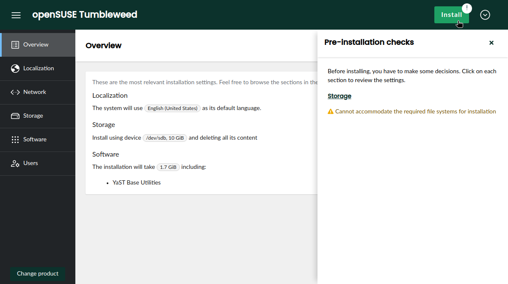

With comming Alpha phase of Leap16 and Beta phase of SLES 16 we added some mandatory features and do polishing with
version 11 release. :tada:

{/* truncate */}

We are just releasing the Agama version 11 and it can still has some minor changes to ensure it can
be included in SLES16 Beta1 and [Alpha of Leap16](https://en.opensuse.org/openSUSE:Roadmap).

So lets not waste a time and jump on new stuff in this release.

## Allow Remote Usage of CLI {#remotecli}

Let's start with some cool and fancy terminal action. :smiley:

CLI is nice way to control installation when there is limited RAM or scripting is needed or you just prefer terminal over web UI.
In Agama 11 the new global parameter `--api` is added to CLI, so script can be run even on different machine
inside your favorite environment and just communicate to target machine which should be installed.

## Generate OpenAPI, Manual Pages, Markdown Documentation and Shell Completion from Sources {#generate}

When we are at CLI in Agama 11 the manual pages, its Markdown variant and also Shell completion is
generated from sources, so we are sure it is always up to date. The markdown you can see already in action
on [agama webpages](https://agama-project.github.io/docs/user/cli). Do not forget that CLI is written
in rust, so its dependencies are really minimal. So no excuses to not give it a try.

For HTTP API we start generating from sources its openAPI specification. This will help anyone
interested in using Agama HTTP Api to generate its own client.

For ones interested in technical details it is implemented using xtask pattern and benefiting from
its integration with clap for CLI or utoipa for OpenAPI.

## Scripting Support in Unattended Installation {#scripting}

Unattended installation already config many options that can be configured in web UI, but users
always welcome more flexibility. And Agama11 give it to them by adding scripts sections.
It is possible to run scripts before and after installation and also after reboot.

The example jsonnet file is below. Note that if you want to use plain json, it does
not support multiline strings and "\n" has to be used.

```jsonnet
{
  scripts: {
    pre: [
      {
        name: "activate-multipath",
        body: |||
          #!/usr/bin/bash
          systemctl start multipathd.socket multipathd.service
        |||
      }
    ],
    post: [
      {
        name: "enable-sshd",
        chroot: true,
        body: |||
          #!/usr/bin/bash
          systemctl enable sshd.service
        |||
      }
    ],
    init: [
      {
        name: "run-ansible",
        url: "https://192.168.1.1/provisioning.sh"
      }
    ]
}
```

For more details see [scripts documentation](https://agama-project.github.io/docs/user/unattended/scripts) on agama pages.

## Slowroll can be Installed {#slowroll}

Popular variant of openSUSE Tumbleweed Slowroll was added to Agama11. So now opensuse iso contain even more distribution variants
to select from. Welcome Slowroll and thanks to @Wesfun for contribution.


## Auto Detect of Leap Installation Medium {#installationlabels}

For openSUSE Agama provides network only medium, but what if user has bad or non-existing network connection?
For such cases Agama11 adds installation labels for Leap16. How it works? If installer detects partition with given
label it will add it as local repository instead of network one. Possible usage is either having more isos attached or
using usb stick with Agama and another partition with Leap16 repository.

TODO: does it deserve entry? Should we document how to do it in agama pages?

## Web UI Changes {#webui}

Web UI gets several improvements. The most visible ones is mandatory root password dialog as we noticed
that almost all users need to go to users section and set it, so it is shown now after initial product
selection dialog.


Another very visible and useful one is having install button always available. If there is issue preventing installation,
then exclamanation mark is shown, details is shownn after clicking  and can lead directly to page that can solve it.




## Registration of Product {#registration}

One of the mandatory features for upcoming SLES16 is product registration. Without it
SUSE Beta partners cannot test new release of SLES. So agama11 have to contain it and
here is the resulting page. It does not affect opensuse iso.


## License Agreement {#license}

Readers maybe notice that opensuse images does not have license agreement, but when it
comes to enterprise linux, it is mandatory to have clear agreement on expectation and responsibles.
And here it comes lawyer times with good EULA and agama time to implement way how to show it to user
and also ask if user agreed with it. So Agama11 integrated for products that require it license agreement on product selection page.


## Storage

TODO: There was a lot of changes and someone with better understanding should summarize it
At least changes in unattended part probably deserve one entry?
interesting PR can be:

- https://github.com/agama-project/agama/pull/1652
- https://github.com/agama-project/agama/pull/1655
- https://github.com/agama-project/agama/pull/1681
- https://github.com/agama-project/agama/pull/1692
- https://github.com/agama-project/agama/pull/1696 maybe too minor?

## Under the Hood {#techdetails}

There are also a lot of changes under the hood including many bug fixes and small improvements.
All three programming languages used in Agama is updated to reflect the latest versions and libraries.
Also our live medium gets a bit of love and now it include kernel drivers that was used in old YaST
installer which leads to a bit smaller medium. We tried also if we can switch to Wayland from X11 and
result is still that it contain some issues, so we will see if it is polished enough in future to do the switch. And more of live iso improvements will follow after Agama11.
We also trying to make our QA guys live easier and implement specifically for them some small changes
that allows more and easier automated integration testing of Agama which hopefully will provide smoother experience to all users.

## Conclusion {#conclusion}

Your contributions and opinions are important sources for feedback about the new release. So don't
hesitate to contact the YaST team at the [YaST Development mailing
list](https://lists.opensuse.org/archives/list/yast-devel@lists.opensuse.org/), our `#yast` channel
at [Libera.chat](https://libera.chat/) or the [Agama project at
GitHub](https://github.com/agama-project/agama) if you find any problem or have an idea for
improvement.

Have a lot of fun!
