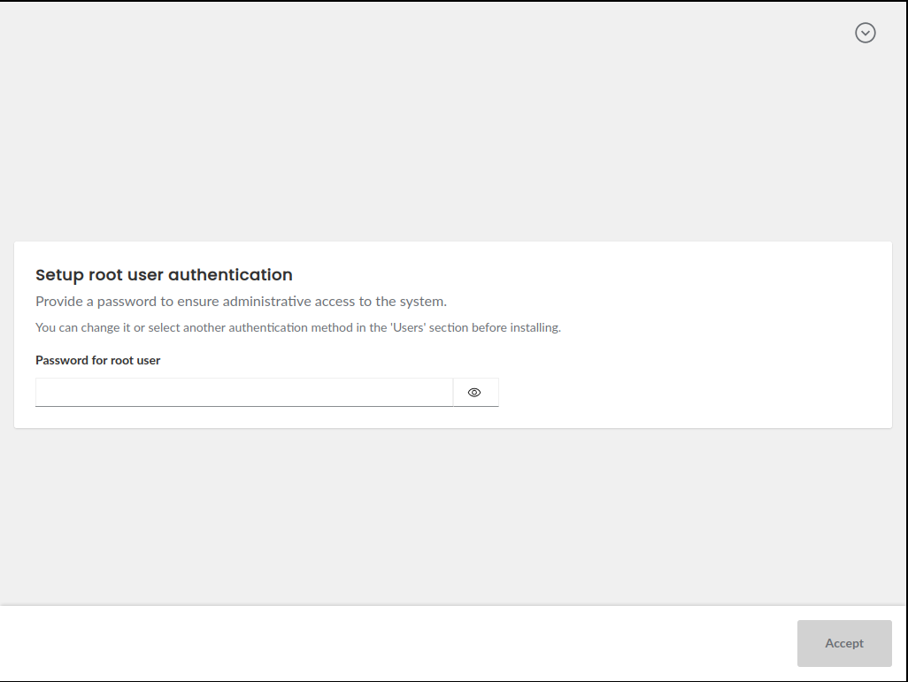
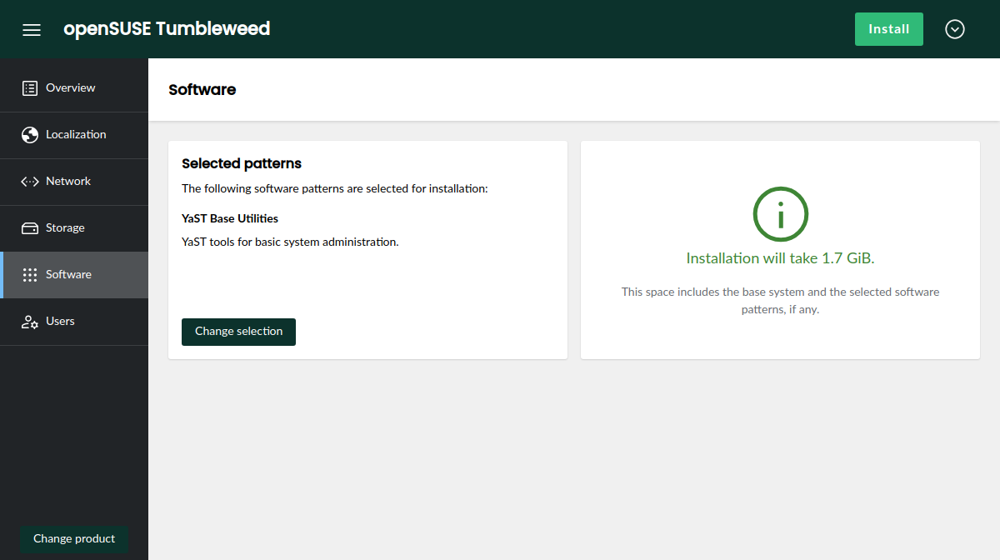

INTRO STILL TO BE REVIEWED

With comming Alpha phase of Leap16 and Beta phase of SLES 16 we added some mandatory features and do polishing with
version 11 release. :tada:

{/* truncate */}

We are just releasing the Agama version 11 and it can still has some minor changes to ensure it can
be included in SLES16 Beta1 and [Alpha of Leap16](https://en.opensuse.org/openSUSE:Roadmap).

So lets not waste a time and jump on new stuff in this release.

## Agama can install Slowroll now {#slowroll}

Let's start welcoming a new member to the family of operating systems Agama can install. Thanks to
[WesFun](https://github.com/WesfunOfficial) now it is possible to select [openSUSE
Slowroll](https://en.opensuse.org/Portal:Slowroll) when using the Agama testing iso for openSUSE.


Keep the contributions coming!

## Air-gapped (offline) installation {#airgap}

SECTION TO BE REWRITTEN...when we clarify also the offline installation for SLE, since I expect we
will generate some documentation.

For openSUSE Agama provides network only medium, but what if user has bad or non-existing network connection?
For such cases Agama11 adds installation labels for Leap16. How it works? If installer detects partition with given
label it will add it as local repository instead of network one. Possible usage is either having more isos attached or
using usb stick with Agama and another partition with Leap16 repository.

TODO: does it deserve entry? Should we document how to do it in agama pages?

## Changes in the web interface {#webui}

Beyond the mentioned new installation possibilities, Agama 11 comes with a small reorganization of
the workflow of the web interface. In previous versions, it was always necessary to visit the
"Users" section to configure the root authentication and then go back to the "Overview" page in
order to proceed with the installation. That happened because authentication is the only aspect of
the system configuration for which Agama cannot infer any reasonable setup. You surely don't want
Agama to choose a root password for you!

Starting with Agama 11, a screen to configure the root authentication is presented to the user right
away after the product selection.



After configuring the root password the user lands in the main Agama screen, where the general
layout has been reorganized to ensure the "install" button is always accessible from all sections of
the interface.



Additionally, the new install button can show a exclamation mark if there are issues preventing the
installation and provides a summary of those issues pointing to the corresponding section that can
be used to solve the situation.


The changes in the web interface go far beyond the new location of the install button. We encourage
you to explore yourself to find all the small improvements!

## Product registration {#registration}

As you all know, one of the main goals of Agama is to become the official installer for SUSE Linux
Enterprise Server 16. The development of that operating system, and its sibling product SLES for SAP
Application, is progressing nicely with some preliminary versions being already available to SUSE
Partners.

Installing those systems requires the user to register in order to gain access to the repositories.
Agama can detect whether registration is necessary and then offer a convenient user interface for
the process, as seen below.


Of course, this feature is irrelevant for openSUSE users since the openSUSE repositories are fully
public and they will always be.

## License agreement {#license}

Another difference between openSUSE and a corporate distribution like SLES is that users needs to
explicitly accept a license agreement to use the latter. In the case of the Agama web interface,
that means presenting the license as soon as possible in the process. Thus, the corresponding
license must be accepted already when selecting any of the products that require to do so.


Of course, the screenshot above belongs to a SLES installation media and openSUSE users will not
notice this new feature.

## Allow remote usage of the command-line interface {#remotecli}

As convenient as an interactive installation with the web interface can be, you know that the
command-line interface and the unattended installation process are also first-class citizen for
Agama. Thus, they also received some love on this release.

Agama's CLI (command-line interface) offers an alternative way to control the installation process
useful in various situations like installing in machines that cannot serve the web interface (eg.
due to limited resources), using scripts and other automation techniques or simply when the user
prefers good old terminal over graphical interfaces. Now Agama's CLI offers a new global parameter
`--api` that allows to run the tool (and any script based on it) on a different machine from that
being effectively installed.

## Scripting support in unattended installation {#scripting}

Years of AutoYaST experience has taught us that, no matter how flexible an installer is, users of
unattended installations always want to go further. And embedding scripting capabilities into the
installer configuration has turned to be an awesome tool for that. So, similar to AutoYaST profiles,
Agama configuration files now offer a "scripts" section. It makes possible to run scripts both
before and after the installation process and also on the first boot of the new system.

Below you can see a [Jsonnet](https://jsonnet.org/) configuration file for Agama including scripts.
Note it would also work with plain JSON but, since that format does not support multi-line strings,
each script would need to be provided as a long string with "\n" marking the end of each line.

```jsonnet
{
  scripts: {
    pre: [
      {
        name: "activate-multipath",
        body: |||
          #!/usr/bin/bash
          systemctl start multipathd.socket multipathd.service
        |||
      }
    ],
    post: [
      {
        name: "enable-sshd",
        chroot: true,
        body: |||
          #!/usr/bin/bash
          systemctl enable sshd.service
        |||
      }
    ],
    init: [
      {
        name: "run-ansible",
        url: "https://192.168.1.1/provisioning.sh"
      }
    ]
}
```

For more details see the [scripts
section](https://agama-project.github.io/docs/user/unattended/scripts) of the Agama documentation
site.

## Storage management for unattended installation {#storage}

The Agama configuration format offers a very convenient and powerful approach to configure the
storage setup of the new system, way more consistent and concise that the corresponding 
`<partitioning>` section of the AutoYaST profile (which is still fully supported for migration
purposes).

Agama 11 adds the possibility to define the physical volumes of an LVM volume group by simply
specifying the disk (or disks) that will be used as a base for the LVM. Agama will take care of
creating all the needed partitions, honoring any other aspect of the configuration in the process.
Find a more detailed explanation with examples at the [corresponding
section](https://agama-project.github.io/docs/user/unattended/storage#generating-physical-volumes)
of the Agama documentation.

On the other hand, now it is possible to specify TPM-based unlocking of the encrypted devices as
part of the Agama storage configuration. Thus, users of unattended installation can also deploy
fully encrypted systems based on TPMv2.

## Generate OpenAPI, Manual Pages, Markdown Documentation and Shell Completion from Sources {#generate}

SECTION STILL NOT REVIEWED

When we are at CLI in Agama 11 the manual pages, its Markdown variant and also Shell completion is
generated from sources, so we are sure it is always up to date. The markdown you can see already in action
on [agama webpages](https://agama-project.github.io/docs/user/cli). Do not forget that CLI is written
in rust, so its dependencies are really minimal. So no excuses to not give it a try.

For HTTP API we start generating from sources its openAPI specification. This will help anyone
interested in using Agama HTTP Api to generate its own client.

For ones interested in technical details it is implemented using xtask pattern and benefiting from
its integration with clap for CLI or utoipa for OpenAPI.


## Under the Hood {#techdetails}

SECTION STILL NOT REVIEWED

There are also a lot of changes under the hood including many bug fixes and small improvements.
All three programming languages used in Agama is updated to reflect the latest versions and libraries.
Also our live medium gets a bit of love and now it include kernel drivers that was used in old YaST
installer which leads to a bit smaller medium. We tried also if we can switch to Wayland from X11 and
result is still that it contain some issues, so we will see if it is polished enough in future to do the switch. And more of live iso improvements will follow after Agama11.
We also trying to make our QA guys live easier and implement specifically for them some small changes
that allows more and easier automated integration testing of Agama which hopefully will provide smoother experience to all users.

## Conclusion {#conclusion}

SECTION STILL NOT REVIEWED

Your contributions and opinions are important sources for feedback about the new release. So don't
hesitate to contact the YaST team at the [YaST Development mailing
list](https://lists.opensuse.org/archives/list/yast-devel@lists.opensuse.org/), our `#yast` channel
at [Libera.chat](https://libera.chat/) or the [Agama project at
GitHub](https://github.com/agama-project/agama) if you find any problem or have an idea for
improvement.

Have a lot of fun!
