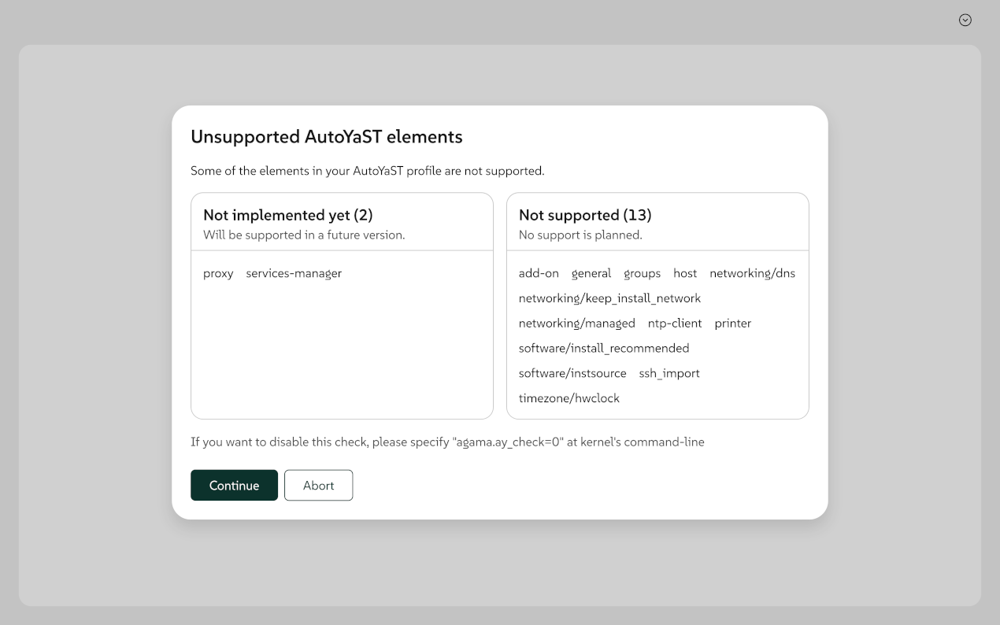

Agama development goes on at good pace and, approximately one month after our latest blog post, we
have more news for you. Not only a new version of Agama with a completely refreshed user interface
and other significant changes, but also some information about the future.

{/* truncate */}

## New visual appearance {#patternfly}

Let's start with the most obvious change introduced at Agama 12. You may know that the Agama web
interface relies on the [Patternfly](https://www.patternfly.org/) framework, the same design system
used by [Cockpit](https://cockpit-project.org/). In this version of Agama, we migrated to the latest
major version of Patternfly (v6), which brings several improvements and quite noticeable visual
changes.  Moreover, we took the opportunity to align with the [SUSE branding
guidelines](https://brand.suse.com/) regarding aspects like typography, colors, etc.

More than ever, in this case a picture is worth a thousand words.

But the changes on the user interface go far beyond cosmetic aspects and general usability
improvements. On top of that, some sections went through an overhaul.

## Revamped Storage section {#storage}

In previous Agama releases, the section of the user interface used to configure the storage devices
(partitions, LVM, etc.) was very powerful. It allowed to create complex setups over single or
multiple disks based on partitions and/or LVM volume groups, to use hard disks directly formatted
(without partitions), to reuse existing partitions or volume groups (optionally re-formatting them)
and much more. But it had some problems.

On the one hand, most users failed to discover how to access to all those features. The interface
was not self-explanatory enough. On the other hand, we were struggling to find a way to add more
functionality (especially software RAIDs) in a consistent way. To make things a bit more
problematic, the configuration generated by that user interface was not fully aligned with the
usual mindset of our users currently relying on profile-based configuration (ie. unattended
installation).

Thus, a couple of months ago, we decided to change the approach of that user interface. But it took
us some time to reach a point in which the new interface is functional enough for basic
configurations.

The new section is still far from its final form and also from providing all the possibilities of
the previous interface. So expect significant updates on future releases, like bringing back the
support to define LVM volume groups. Meanwhile, you can read about its existing and future
capabilities at the [corresponding section](/docs/user/storage) of the Agama user
documentation.

## Changes in authentication management {#users}

Security is a topic that demands constant re-evaluation. When it comes to a Linux system, one of
the first aspects of security is the way to organize users, privileges and authentication. SUSE
and openSUSE have been reconsidering lately how to approach that and it seems clear that the
traditional role of the root user and the default configuration of `sudo` are going to change in
future releases of SLE and openSUSE Leap.

Agama 12 already takes the first steps to adapt to the new situation, removing the mandatory step to
set a password for the root user and introducing a new Authentication section instead of the former
Users one.

This is just the first iteration for a part of Agama that will receive several improvements
regarding usability and wording in upcoming releases.

## Post-partitioning script {#post-partitioning}

Not all changes at Agama 12 affect the user interface. Unattended installation also received a bunch
of improvements, including the ability to execute scripts right after setting up the storage layout.

As you may know, both AutoYaST and Agama offer the possibility to specify custom scripts that can be
executed at several points of the installation workflow. In previous versions Agama already offered
the so-called pre-installation scripts, post-installation scripts and init scripts. But now Agama 12
offers also post-partitioning scripts that can be used, among many other things, to deploy
configuration files before the packages are installed, modifying with that the behavior of the
scripts included at RPM packages.

## Information about AutoYaST compatibility {#autoyast}

And talking about unattended installation, we cannot forget one of the main features of Agama - its
backwards compatibility with AutoYaST. Such a compatibility is not perfect and never will be, due to
the difference in scope between both Agama (focused on installation) and AutoYaST (a more general
configuration tool).

Now when Agama reads an AutoYaST profile it informs the user about the sections that will be
ignored, making a difference between those sections that will be supported soon by Agama and those
that are considered to be out of its scope even for the future.

The report can be disabled by specifying `agama.ay_check=0` as a boot parameter.

We also took the opportunity to update the corresponding information at the [AutoYaST compatibility
reference document](/docs/user/unattended/autoyast/reference). What is even better, we introduced some
mechanisms to generate such a document based on the same information used by Agama to generate the
compatibility report during execution, so we can make sure the documentation is in sync with the
actual implementation.

## Improvements at the Live ISO {#agama-live}

Most users will execute Agama using the default installation media for SUSE or openSUSE
distributions, which we unsurprisingly call Agama-live (since it is just a live Linux system
running Agama).

Although the installation media is relatively independent from Agama itself, we take every Agama
release as an opportunity to announce some of the latest improvements. In this occasion that includes
some tweaks to the underlying window manager (IceWM), less aggressive settings for both power
saving and the screensaver and the ability to open a terminal emulator by pressing `ctrl`+`alt`+`t`.

Find the latest version of the openSUSE Agama Live ISO image, including Agama 12, at its [usual
location](https://download.opensuse.org/repositories/systemsmanagement:/Agama:/Devel/images/iso/).

## A glance into the future {#roadmap}

This time we will use the release of Agama 12 as an opportunity to announce something else. We
decided to add a [Roadmap](/about/roadmap) section to the Agama home page.

They say "_plans are useless, but planning is indispensable_". That may be the case of the Agama
roadmap. We have a clear goal in the mid term, but we are constantly re-evaluating our priorities
and the next steps to be taken. As such, you can expect that document to be updated often. Do not
carve it into stone!

## See you soon! {#conclusion}

As you can see in the mentioned roadmap, we plan to release Agama 13 by the end of March. And of
course that will mean another blog post for you to enjoy the YaST Team adventures.

Meanwhile, you can also find us at [SUSECON 2025](https://www.suse.com/susecon/), which will take
place at Orlando (USA). Part of the team will be there to meet our beloved users and conduct a
couple of sessions about Agama.

If you cannot be there in person, you can of course meet us at our usual online channels, like the
[Agama project at GitHub](https://github.com/agama-project/agama) and the `#yast` channel at
[Libera.chat](https://libera.chat/).

Have a lot of fun!
