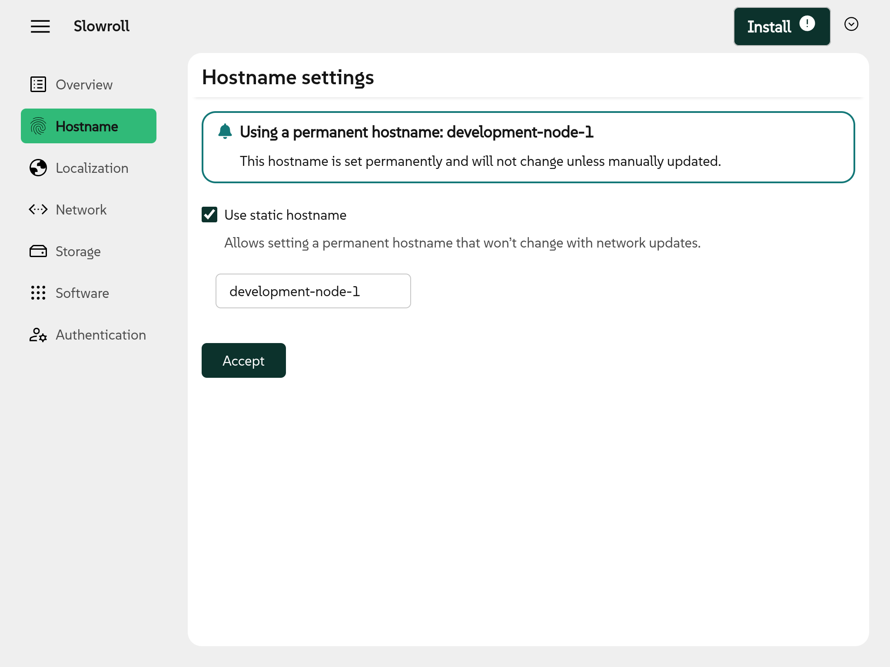
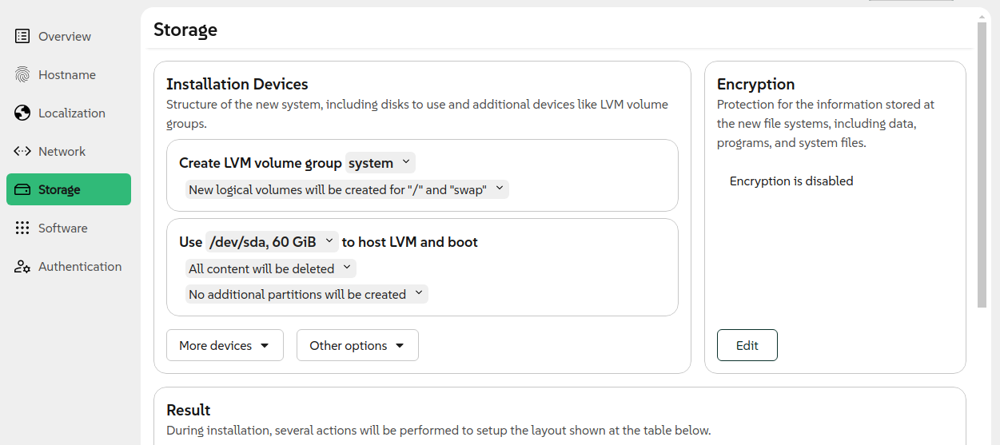

Time flies and more than a month has passed since the announcement of Agama 12. Fortunately the YaST
Team has not been idle and we have a new version of Agama to present. Say hello to Agama 13,
including some additions to the web interface and many improvements for unattended installations.

{/* truncate */}

## Setting the hostname {#hostname}

Let's start with a feature that some people would consider rather basic or, at least, something easy
to implement - the ability to set a name for the machine (ie. hostname) during installation. The
naked truth is that it took us some time to open that can of worms because it is a rather
complicated topic.

First of all, there is nothing like a unique hostname since a machine can have different
names depending on the network interface used to interact with it. Moreover, those names can be
static or transient and there are several mechanisms to set or modify them with relatively complex
precedence rules in several situations.

One of those mentioned mechanisms, already available at previous versions of the Agama-Live
installation media, was specifying the `hostname=` boot argument. In Agama 13 we extended that with
some limited support to configure the hostname at the Agama configuration (to be used by the
command-line interface and during unattended installation) and with a simple dedicated section at
the web user interface.



Hostname settings are not expected to remain at its own separate section of the user interface for
long. We plan to integrate it in another section (likely a new one called "System") in future
releases of Agama.

## Installing on LVM {#lvm}

Another feature that got a preliminary user interface at Agama 13 is the ability to install using
[LVM](https://en.wikipedia.org/wiki/Logical_Volume_Manager_(Linux)) (Logical Volume Manager).

As you may know, it was already possible to define LVM volume groups and logical volumes at the
`storage` section of the Agama configuration that can be used both in unattended installation and
in the command-line interface. Agama 13 provides a first integration of that functionality into the
web user interface.



The new interface is still a bit rough around the edges but already allows to define one or more
volume groups with any number of logical volumes. Agama will automatically calculate all the final
  sizes both for the logical volumes and for the partitions needed to host the LVM physical volumes.

## Register extensions from the SUSE Customer Center {#extensions}

The possibilities offered by default by any (open)SUSE Linux distribution can be extended adding
extra repositories. In the case of enterprise-grade products like SLES that means activating
add-ons and extensions, which may be subject to some registration process before being available
for installation.

For that purpose, the product configuration at Agama 13 was extended with the option `addon`.
The following example shows how that could be used to register the High Availability extension
that can be added to any installation of SUSE Linux Enterprise Server thanks to the
[SUSE Customer Center](https://scc.suse.com/).

```json
{
  "product": {
    "id": "SLES",
    "registrationCode": "<CODE>",
    "addons": [
      {
        "id": "sle-ha",
        "registrationCode": "<CODE>"
      }
    ]
  }
}
```

As you already know, adding a feature to the Agama configuration implies it can be used during
unattended installation and also on interactive installations using the command-line interface. But
it does not imply such a feature will be automatically available at the web user interface of Agama.

In the case of registering extensions, we are already working to make it possible via the web UI
for Agama 14, expected to be released by the end of April. That is not the case for another of the
features we recently added to the Agama configuration.

## Selecting individual packages to install {#packages}

Similar to the `product` section, Agama 13 also extends the `software` one with new possibilities.
In addition to the previously available list of patterns, now it is also possible to specify a list
of individual packages, not necessarily contained on any pattern.

```json
{
  "software": {
    "patterns": ["gnome_desktop"],
    "packages": ["vim"],
  }
}
```

As mentioned before, there are no plans to add such a fine-grained software selection to the web
user interface of Agama.

## Support for AutoYaST-style URLs {#urls}

As you may know, one of the goals of Agama is to provide a seamless transition from AutoYaST. That
implies being able to read the configuration for the unattended installation from the same locations
that AutoYaST can handle.

The configuration is usually indicated by a URL that is passed to the installer. But AutoYaST URLs
are one of a kind - they support all kind of non-standard schemes like `device://` or `label://`, each
of them with their own AutoYaST-specific semantic.

Agama now supports URLs starting with `device:`, `usb:`, `label:`, `HD:`, `DVD:` and `cd:`. You can
know more about those special schemas at the [corresponding page](https://agama-project.github.io/docs/user/urls)
of the Agama documentation site. Support for well-known URL schemas (like `file:`, `http:`, etc.)
is still implemented using [curl](https://curl.se/) under the hood.

:::warning

As a result of the changes introduced to implement this feature, the command `agama download` now
requires specifying a DESTINATION file. It does not longer write the downloaded content to the
standard output, which is now used to inform the user about the searching process.

:::

## Automated search of unattended configuration {#oemdrv}

And talking about searching, you may know that AutoYaST is able to find the auto-installation
profile at several predefined locations, even if no URL was explicitly specified by the user.
As part of our effort to make Agama an almost-direct replacement for AutoYaST we implemented a
very similar functionality.

If Agama is started in automatic mode but no configuration (profile) is specified, Agama will
automatically search for it in the same pre-defined locations used by AutoYaST. In those cases,
Agama expects a file named `autoinst.jsonnet`, `autoinst.json` or `autoinst.xml` (in that
order) to be located on:

- The root of a file system with the label `OEMDRV`.
- Or the root (`/`) of the installation environment.

The first file found is used as the profile, starting the installation right away.

## Deploy files during installation {#files}

Going further into the role of Agama as an AutoYaST successor, you may know that AutoYaST allows
to deploy complete configuration files using the `<files />` element. Just like scripts, it is
possible to embed the file content in the profile or, if preferred, to retrieve it from a remote
location.

Of course, we decided Agama should offer the same functionality that you can see in action in the
following example.

```json
{
   "product": {
      "id": "Tumbleweed",
   },
   "user": {
      "fullName": "beloved TUX",
      "password": "tux",
      "userName": "tux"
   },
   "root": {
     "password": "linux"
   },
   "files": [
      {
        destination: "/home/tux/scripts/test.sh",
        content: |||
          #!/usr/bin/bash
          systemctl start multipathd.socket multipathd.service
        |||,
        permissions: "755",
        user: "tux",
        group: "users"
      },
      {
        destination: "/root/test2.md",
        url: "https://gist.githubusercontent.com/example/a_file.md"
      }
   ]
}
```

:::warning

During the implementation of this feature we also decided to rename the attribute `body` of the
`scripts` section. Now it uses `content`, for consistency with the new section.

:::

## We keep moving {#conclusion}

We are already working at Agama 14, that will provide new functionality and will improve some of
the features introduced at Agama 13. Meanwhile do not hesitate to give Agama a try using our
[latest Live ISO images](https://download.opensuse.org/repositories/systemsmanagement:/Agama:/Devel/images/iso/).

As always can contact us at the [Agama project at GitHub](https://github.com/agama-project/agama)
and our `#yast` channel at [Libera.chat](https://libera.chat/). See you soon!
