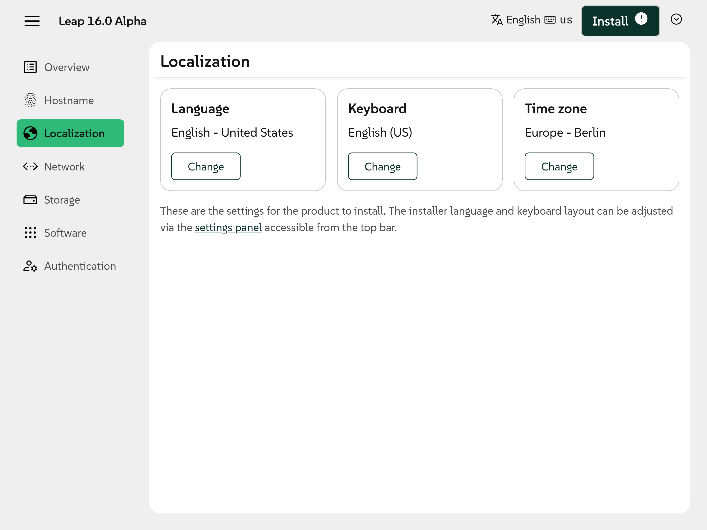
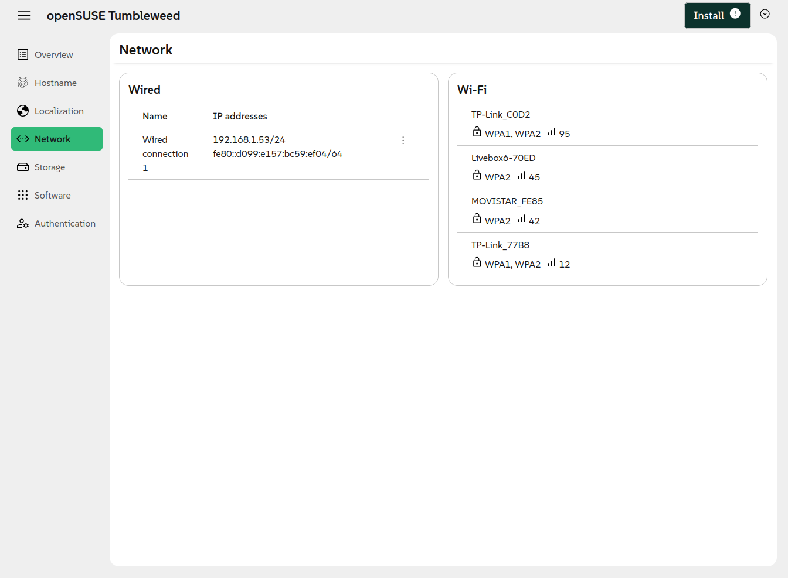
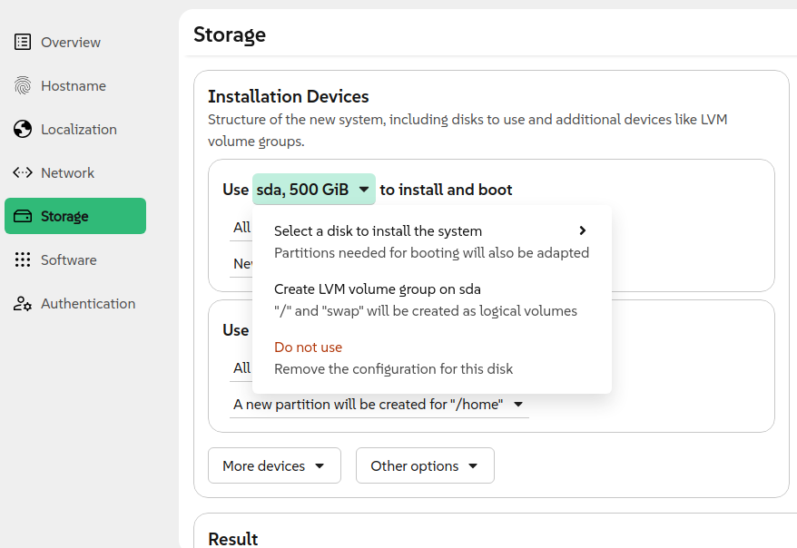
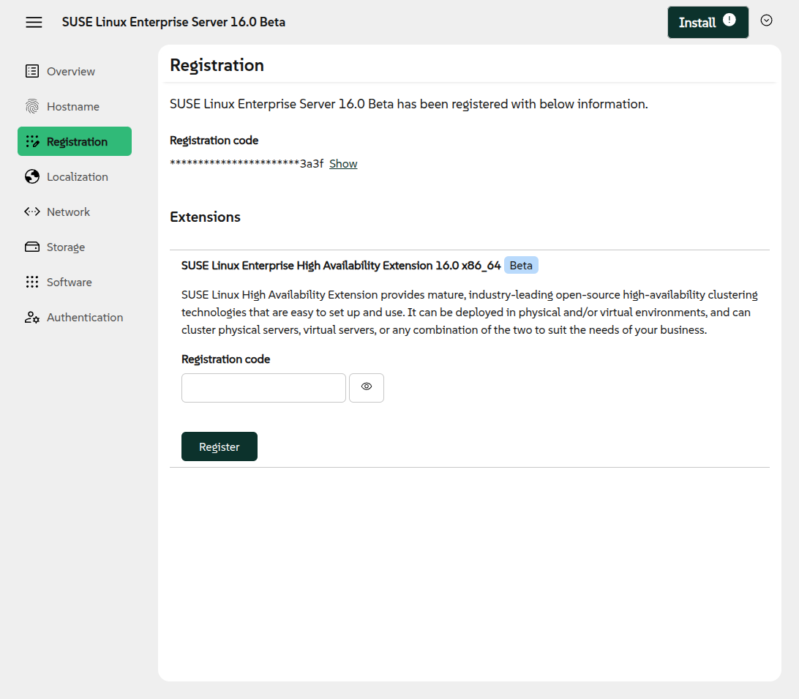
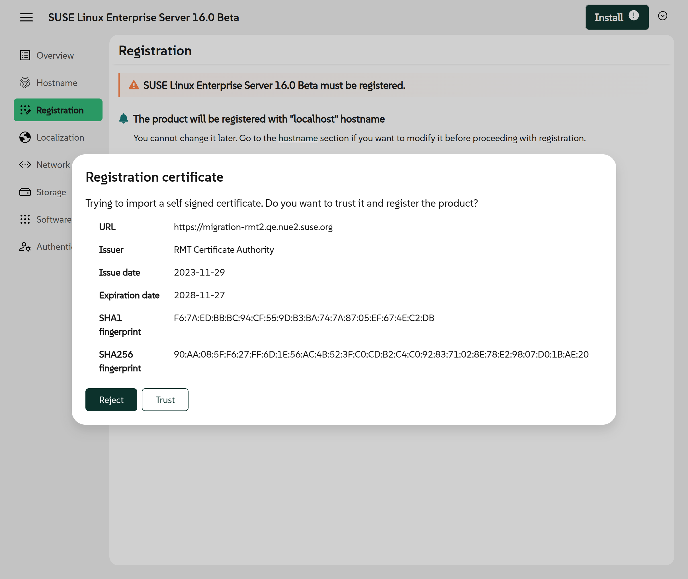
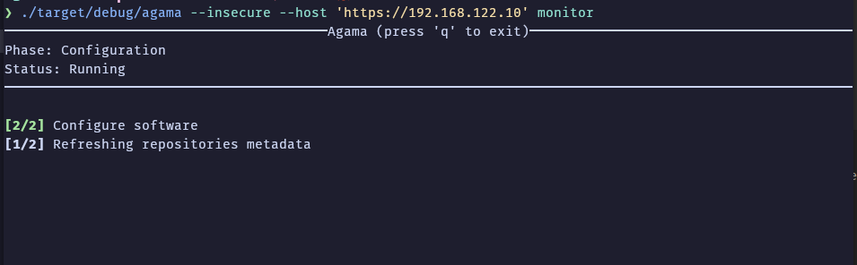

Agama 15 is out and it is time for a new blog post after our previous announcement of... wait...
Agama 13? You may be wondering what happened to Agama 14. The answer is easy, we released it but we
were too busy to write the corresponding blog post. So this will serve as an announcement for both
versions.

Let's jump directly into the new features because there is a lot to cover.

{/* truncate */}

## Usability improvements related to localization {#l10n}

We will start with those features affecting directly the web user interface. And in that regard we
have to mention the changes introduced in the internationalization area. Agama offers two different
localization (l10n) configurations:

 * One for the installer interface (language and keyboard layout).
 * Another for the installed Linux distribution (language, keyboard layout, and timezone).

There are many good reasons for that distinction, but users of previous versions of Agama used
to confuse these settings despite being configured at different places of the user interface. That
should not be the case anymore thanks to the many usability improvements introduced by this [pull
request](https://github.com/agama-project/agama/pull/2359), which includes a detailed description of
the changes with many screenshots.



## Revamped Wi-Fi user interface {#network-ui}

The network section of the web user interface also received many usability improvements, especially
regarding the configuration of Wi-Fi connections. Once again, the individual changes are too many to
be listed here but can be checked at the description of the [corresponding pull
request](https://github.com/agama-project/agama/pull/2247) at Github.



## Clarify options at the storage page {#storage-ui}

If there is another aspect of the configuration that can be as challenging as the network,
that is the storage setup. We keep adding more options on every Agama release and sometimes that
implies we must invest some time polishing small details to make the whole user interface more
understandable.

In that regard, Agama 14 reorganized the contextual menus on the storage section to help users find
the option they are looking for and understand the implications of each action.



## Registration: extensions and certificates {#registration}

And talking about adding new options to Agama, we also have to consider which of those options are
available at the web interface and which ones are there only to be tweaked using the command line
or a configuration file (eg. during unattended installation). The possibility of fine-tuning the
registration process was an example of the latter... until now.

Agama 14 made it possible to use the web interface to register extensions. Those extensions allow
to add more capabilities to SUSE Linux Enterprise right from the installation of the system.



But that is not the only news regarding registration. Agama 15 also added more options to deal with
self-signed certificates for those SUSE customers using RMT (Repository Mirroring Tool) to manage
subscriptions on their own internal network.



Management of certificate warnings and errors go beyond the visual interface and Agama 15 also offers
several ways to handle the situation on unattended installations. In fact, the possibilities of
unattended installations are dramatically expanded with these new releases of Agama. Starting with
a special case.

## Unattended configuration for iSCSI and DASD devices {#dasd-iscsi}

We usually implement new features first in the configuration used for unattended installation (the
profile, using AutoYaST jargon) and only later we decide whether the given feature must be available
at the web interface and, if so, to what extent. But the case of iSCSI and DASD configuration was
an exception. Due to their special nature, we first implemented interactive management for them,
available already at the early versions of the Agama web interface. Users have had to wait until
recent versions 14 and 15 to be able to configure iSCSI and DASD respectively using only a section
of the Agama configuration.

We are in the process of improving the documentation for the Agama configuration, but meanwhile
examples for both storage technologies can be found at [Agama's
examples](https://github.com/agama-project/agama/tree/master/rust/agama-lib/share/examples)
directory.

## Storage section: improved searches and software RAIDs {#storage}

And talking about unattended installation and storage technologies, Agama 15 also represents a step
forward in the way to select and combine the disks and partitions in the target system.

On the one hand, the `search` property that allows to match existing devices with definitions in the
configuration was improved to support filtering by name, size and partition number. On the other
hand, this Agama release includes the first fully functional implementation of the property
`mdRaids` that allows to create and reuse MD RAID devices.

The combination of those new features allows to create configurations like the following.

```json
{
  "storage": {
    "drives": [
      {
        "search": {
          "condition": { "size": { "greater": "1 TiB" } },
          "max": 2,
        },
        "partitions": [
          { "search": "*", "delete": true },
          {
            "size": "20 GiB",
            "alias": "parts-for-root"
          },
          {
            "size": { "min": "1 GiB" },
            "alias": "parts-for-home"
          }
        ]
      },
    ],
    "mdRaids": [
      {
        "devices": [ "parts-for-root" ],
        "level": "raid0",
        "filesystem": { "path": "/" }
      },
      {
        "devices": [ "parts-for-home" ],
        "level": "raid1",
        "name": "data",
        "encryption": {
          "luks2": { "password": "notsecret" }
        },
        "filesystem": { "path": "/home" }
      }
    ]
  }
}
```

## Advanced boot loader configuration {#bootloader}

Apart from the storage configuration, there are other aspects where users of unattended
installation may have special requirements. One of those areas is the configuration of the boot
loader.

The new Agama versions allow to setup an arbitrary timeout for the menu and also additional
parameters to be passed to the kernel on every boot of the target system.

```json
{
  "bootloader": {
    "timeout": 10,
    "extraKernelParams": "verbose"
  }
}
```

## Creation of network bridges {#bridge}

The network section of the configuration was also expanded with the possibility to define bridge
interfaces. As you can see in the following example, the syntax follows the same general principles
than the previously existing support for network bonding.

```json
{
  "network": {
    "connections": [
      {
        "id": "Bridge0",
        "method4": "manual",
        "interface": "br0",
        "addresses": ["192.168.1.100/24"],
        "gateway4": "192.168.1.1",
        "nameservers": ["192.168.1.1"],
        "bridge": {
          "ports": ["eth0", "eth1"],
          "stp": false
        }
      }
    ]
  }
}
```

But not all improvements in the unattended installation field correspond to new configuration
options or sections. There are also other aspects of the experience we decided to enhance.

## Relative URLs at the Agama configuration {#relurl}

As the most seasoned (open)SUSE users know, AutoYaST may be a bit singular when it comes to URLs.
One of the most creative AutoYaST tricks is the usage of an AutoYaST-specific schema `relurl` to
specify URLs that are relative to the location of the profile. Of course, specifying resources
relatively to the profile is useful in many scenarios, but for Agama we decided it could be done
better.

Instead of porting `relurl`, Agama 15 introduces the concept of **URL reference**, well known from
HTML and standardized at [RFC3986](https://datatracker.ietf.org/doc/html/rfc3986.html). You can see
the difference between an absolute and a relative URL in the following example.

```json
{
  "files": [
    {
      "destination": "/etc/issue.d/readme.issue",
      "url": "http://192.168.122.1/agama/issue-readme",
    },
    {
      "destination": "/etc/issue.d/agama.issue",
      "url": "./issue-sles",
    }
  ]
}
```

## Improvements at the command-line interface {#cli}

So far we described many improvements for both the web user interface and the unattended
installation process. But as you know, the latter is not really any special mode at Agama, but just
a way to trigger the installation in a way in which it still can be monitored and controlled using
the mentioned web interface or Agama's command-line tools.

During this sprint we improved several aspect of those tools, especially regarding its ability to
interact with remote systems, and implemented a new command `agama monitor` that can be used to
connect to any ongoing installation and follow the process.



We must admit the previous screenshot corresponds to an improved version of the `agama monitor`
command which is not included at Agama 15. Because, of course, this release is just another step in
the long way to our Agama vision.

## More to come {#conclusion}

As you can see, we are already working on Agama 16 and beyond. You can check our plans at the public
[project roadmap](/docs/roadmap) and test the latest development version using the corresponding
[Live ISO images](https://download.opensuse.org/repositories/systemsmanagement:/Agama:/Devel/images/iso/).

If you got questions or want to get involved, do not hesitate to contact us at the [Agama project at
GitHub](https://github.com/agama-project/agama) and our `#yast` channel at
[Libera.chat](https://libera.chat/). Have a lot of fun!
