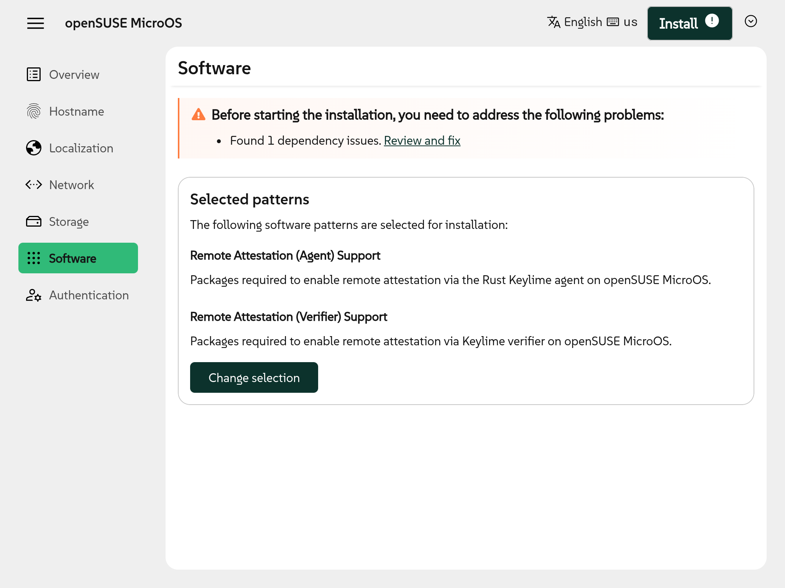

As we dive into the European summer, Agama development goes on steady. And what is more refreshing
than a new version of a Linux installer? Enjoy Agama 16, loaded with bug fixes and several features
covering both unattended and interactive scenarios.

{/* truncate */}

Regarding the former, we keep expanding the configuration options that are accessible using the
Agama command line tools and the JSON profiles. So let's start by taking a look to those features
before jumping into the more visible user interface changes.

## More options to configure the software to install {#software}

In particular the software section of the configuration schema received a couple of extra features
in this version, like the ability to define additional repositories and the possibility to ignore
optional dependencies, installing only those packages that are strictly required.

See the [documentation of the corresponding section](/docs/user/reference/profile/software) to
learn more about the new `extraRepositories` and `onlyRequired` configuration options.

## Better match of storage devices {#search}

Another aspect of Agama that unleashes its full potential when using JSON profiles is the setup of
the storage devices (disks, RAIDs, partitions, LVM, etc.). In that regard, this new version adds the
new keyword `sort` that can be used when matching existing devices with the definitions at the JSON
configuration.

That is used in the following example to indicate that an MD RAID must be created using the two
biggest disks in the system.

```json
"storage": {
  "drives": [
    {
      "search": {
        "sort": { "size": "desc" },
        "max": 2,
      },
      "alias": "big"
    }
  ],
  "mdRaids": [
    {
      "devices": [ "big" ],
      "level": "raid0"
    }
  ]
}
```

See more examples of the syntax at the description of the corresponding [pull
request](https://github.com/agama-project/agama/pull/2474).

## Reporting installation status via IPMI {#ipmi}

The features discussed previously allow more flexibility for unattended and massive deployments.
But in addition to configuring the installation process, it is also important to be able to monitor
its progress. For that purpose, Agama 16 introduces status reporting via IPMI ([Intelligent Platform
Management Interface](https://en.wikipedia.org/wiki/Intelligent_Platform_Management_Interface)), a
set of standard interfaces that, among many other things, allow system administrators to install
operating systems remotely.

Now Agama can report to the BMC (Baseboard Management Controller) the status of the installation
process like STARTED, FINISHED or FAILED. Of course, Agama's own monitoring mechanisms can
additionally be used to get more fine-grained information that goes beyond the intentionally
generic IPMI specification.

## Reorganization of the Agama commands {#cli}

And talking about Agama tools for monitoring and configuring the installation, we also decided it
was time for a consistency check on our commands, especially `agama config` and `agama profile`.
Compared to previous versions of Agama:

  - `agama profile import` is replaced by `agama config generate | agama config load`.
  - `agama profile evaluate` and `agama profile autoyast` are replaced by `agama config generate`.
  - `agama profile validate` is renamed to `agama config validate`.
  - All sub-commands use stdio in a consistent way, using a new `--output` option when needed.

See more information at the [command-line reference](https://agama-project.github.io/docs/user/cli).

## Identify conflicting patterns {#conflicts}

Although many of the improvements at Agama 16 are targeted at automated installations and advanced
scenarios, we also found time to partially polish some basic aspects of the graphical web-based
interface.

For example, we added a first basic mechanism to detect and fix conflicts in the selection of the
software patterns to install. You can see it in action at the following screenshot.



## Initial support to use existing MD RAIDs from the web interface {#raid}

As mentioned above, Agama allows to create very advanced storage setups combining LVM, MD RAID and
other technologies. But currently only a limited subset of those options are available at the
graphical interface. As a first step to expand the usefulness of that interface in advanced
scenarios, Agama now offers the possibility to select any existing MD RAID device and use them for
the same operations that are available for regular disks.


## Define the scope of network connections {#network}

Another aspect of the installation that can get really complex is the network configuration. We
would need a whole series of blog posts to fully explain all the associated challenges. As a
simplistic summary, let's say Agama 16 introduces two new related features at the user interface.

On the one hand, the UI now allows to associate a given network connection to a fixed network
interface, either by interface name or by MAC address.

On the other hand, we made the concept of "persistent" network connections visible, allowing the
users to decide which connections should be used only during installation and not configured in the
installed system.


Moreover, if Agama detects that no network will be explicitly configured by the installer at the
target system, it now alerts the user about the implications. 

## More friendly experience for remote installations {#reboot}

And talking about network, one of the main features of Agama is the possibility to install remotely
using a browser to interactively control the installation process from another device. But there was
a small usability problem in that scenario. At the end of the process, Agama offers the possibility
to reboot into the new system. But the users received no visual feedback after clicking that
"reboot" button.

That is fixed now, see the corresponding [pull
request](https://github.com/agama-project/agama/pull/2462) if you are interested in the most
intrincate technical details.


## Check strength of the typed passwords {#password}

But that was not the only usability issue addressed at Agama 16. We also took the opportunity to pay
a historical debt - the lack of a mechanism at the user interface to discourage the usage of weak
passwords.

Now Agama relies on `libpwquality` to perform some basic checks and alerts the user if any of the
provided passwords fails to match the quality standards of that library.


But the recent improvements go beyond Agama itself.

## Installer media news: Wayland and rescue mode {#live}

We often make the distinction between Agama and the [Agama Live ISO](/download). The former is the
installer application itself, while the latter refers to the Live image that can be used to boot a
minimal Linux system that runs Agama and a full-screen web browser to interact with it.

Although the Agama team is not in charge of the installer media of the different (open)SUSE
distributions, our Live ISO serves as some kind of reference implementation of the expected
environment to execute Agama. So we decided to invest a bit into it.

First of all, we introduced the option to boot the Live ISO without executing Agama or any graphical
session. We did it with the intention to mitigate the pain of those users missing the classical
Rescue System that is traditionally integrated into the openSUSE installation images. But the new
option is far from being a full replacement for that special system, check the corresponding [pull
request](https://github.com/agama-project/agama/pull/2403) for more information.


On the other hand, and thinking in the long term, we decided is about time to jump into the
[Wayland](https://wayland.freedesktop.org/) boat. So we dropped [X.Org](https://www.x.org) and
decided to rely on Wayland for running Firefox during installation.

The new installer image is still a bit rough around the edges. First of all, it is considerably
bigger than the former X11-based image. And we lost some keyboard shortcuts in the process. We plan
to put some work into it in the short term, but any help is greatly appreciated.

## Get involved {#conclusion}

We want Agama to be the official installer for the upcoming openSUSE Leap 16.0 and SUSE Linux
Enterprise 16.0. And for that we need the installation media to be tested in as many scenarios as
possible. Especially with that recent switch from X11 to Wayland. So do not hesitate to test the
[latest development version](https://download.opensuse.org/repositories/systemsmanagement:/Agama:/Devel/images/iso/).

If you got questions or want to get involved further, please contact us at the [Agama project at
GitHub](https://github.com/agama-project/agama) and our `#yast` channel at
[Libera.chat](https://libera.chat/). Of course, we will also keep you updated on this blog. Stay
tuned!
