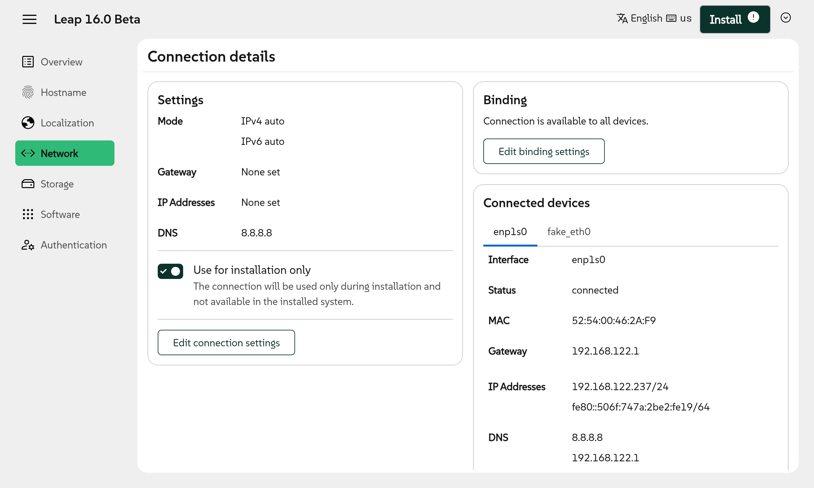
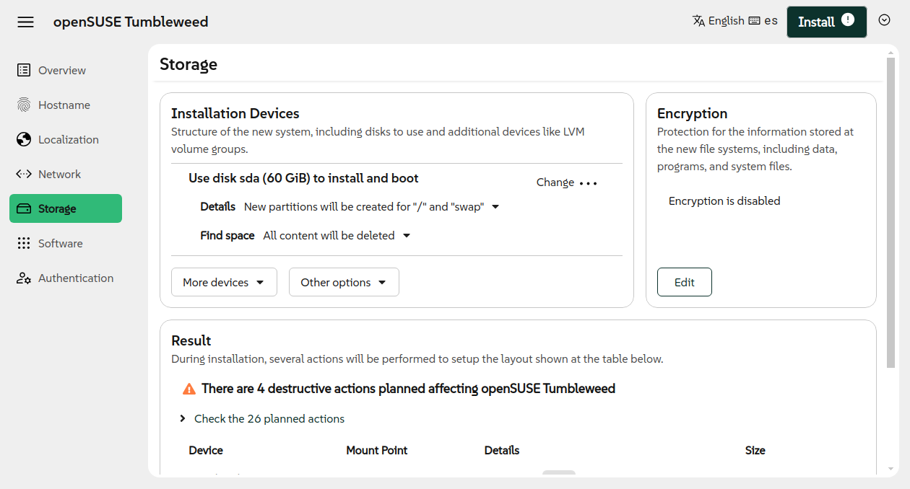
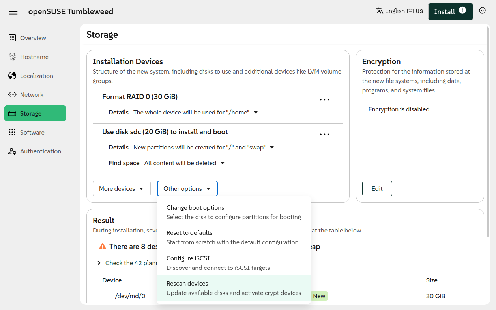
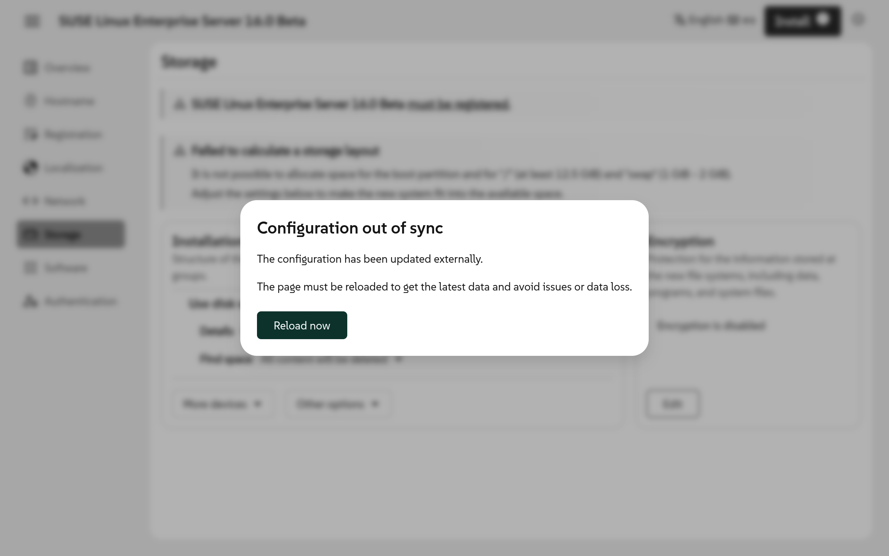
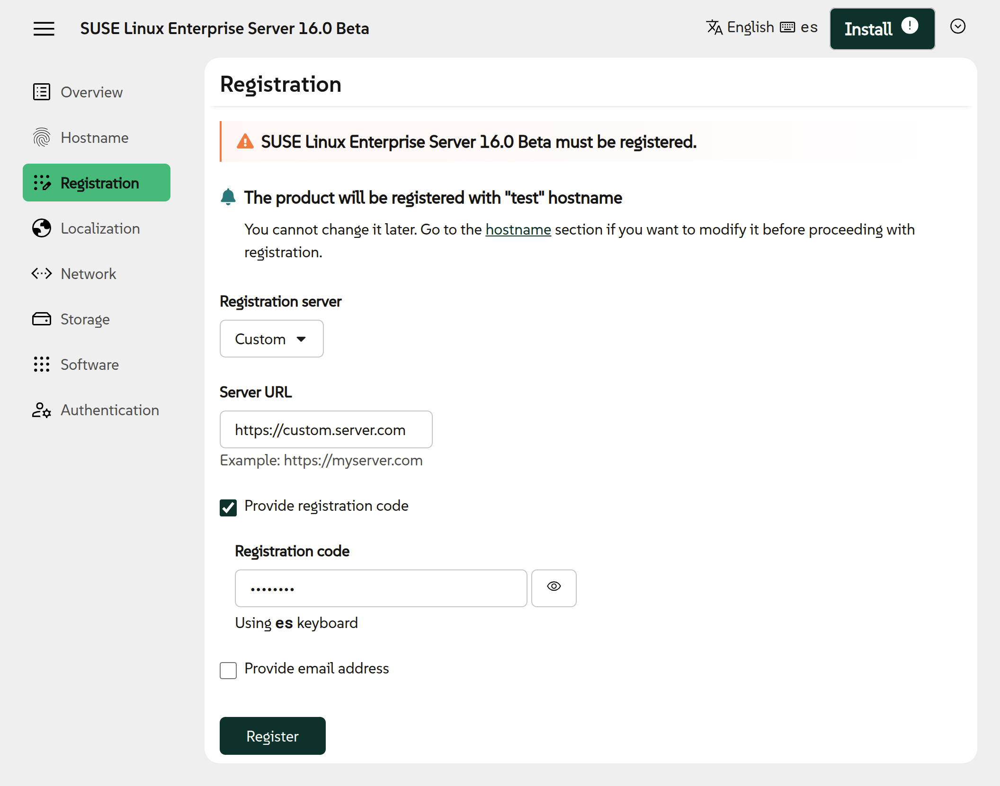

Summer is vacation season, at least in Europe, and that usually means nothing seems to move too
much. But since there is an exception to every rule, here comes a new Agama version to prove that
not even heat can stop Free Software!

{/* truncate */}

Agama 17 represents an important milestone for the Agama project. Taking into account how close
the release of SUSE Linux Enterprise 16.0 is, we foresee this version of Agama (or a very similar
one) becoming the endorsed installer for that release of SUSE's flagship distribution.

So let's see what's new.

## Better representation of wired network connections {#network-ui}

Starting with the web user interface, the page to display and configure a concrete wired interface
was heavily reorganized to improve clarity and to correctly represent the situation in which several
devices share the connection.



## Improvements in the storage user interface {#storage}

The page to configure the storage setup was also slightly restructured. The information displayed
at the "Installation Devices" section was reorganized with the goal of making its usage more
understandable at first sight.



This is just an intermediate step to our envisioned user interface. But that is how goals are
reached - one step at a time.

Apart from reorganizing the information, the new user interface offers the possibility to directly
use a disk (or a pre-existing RAID device) without creating partitions.

There is also a new option to re-scan the system in case new hardware devices has been plugged in, new
logical devices (line RAIDs or LVM volume groups) have been created or the user needs a second chance
to enter an encryption password.



Last but not least, the user interface can now detect when an Agama configuration has been loaded
affecting the storage setup.



## More options at the registration page {#rmt}

To finish the recap of the main changes at the user interface, we must mention the registration
page. Apart from registering the system on the SUSE Customer Center ([SCC](https://scc.suse.com/)),
now the user interface can be used to register the system on a custom instance of RMT (Repository
Mirroring Tool).



Users of such RMTs do not longer need to use a configuration profile or Agama's command-line
tools, like in previous versions of the installer.

## Skipping SELinux configuration {#lsm}

The default installations of SUSE Linux Enterprise Server 16.0 and openSUSE Leap 16.0 will use
[SELinux](https://en.wikipedia.org/wiki/Security-Enhanced_Linux) as the default Linux kernel
security module (LSM). But it is possible to adjust the software selection to not install
SELinux or to install an alternative LSM (like [AppArmor](https://en.wikipedia.org/wiki/AppArmor)).

Previous versions of Agama did not manage that situation correctly. Agama always enforced the
configuration of the default LSM for the product (SELinux in the mentioned cases).

Now the configuration of the LSM is based on the software selection. At the end of the installation
process, Agama configures the installed security module. If several ones are installed, Agama
configures one of them, with the default one having precedence over the other candidates.

## New options in the JSON configuration {#unattended}

As most of our readers know, the best way to access the full potential of Agama is to use a JSON (or
Jsonnet) configuration. That goes far beyond the options offered by the web interface and is the
default mechanism to configure unattended installations.

Agama 17 adds the possibility to configure VLAN interfaces. See the following example.

```json
{
  "id":          "vlan10",
  "method4":     "manual",
  "method6":     "disabled",
  "addresses":   ["192.168.1.28/24"],
  "gateway4":    "192.168.1.1",
  "nameservers": ["192.168.1.1"],
  "vlan": {
    "id":     10,
    "parent": "eth0"
  }
}
```

Now it is also possible to activate zFCP devices by specifying the corresponding section at the
JSON configuration, like in this example.

```json
{
  "zfcp": {
    "devices": [
      {
        "channel": "0.0.fa00",
        "wwpn":    "0x500507630300c562",
        "lun":     "0x4010403300000000"
      }
    ]
  }
}
```

This version also adds more flexibility to define the list of software patterns to be installed. In
previous versions, it was only possible to specify a whole list that would replace the default list
of optional patterns defined by the product. Now it is possible to ask Agama to modify that list,
just adding or removing certain patterns.

```json
{
  "software": {
    "patterns": {
      "remove": ["selinux"],
      "add":    ["apparmor", "gnome"]
    }
  }
}
```

But sometimes it is Agama that wants to ask something to the user. For example, when it finds an
encrypted device and needs the password to inspect its content. If that happens, Agama's user
interface can show a dialog for the user to provide the answer. But there are more options to
communicate those answers to Agama, like using the command `agama questions` to load a file
containing answers. Agama 17 introduces a third way - the new `questions` section at the JSON
configuration. Again, let's illustrate it with an example.

```json
{
  "questions": {
    "policy": "auto",
    "answers": [
      {
        "class": "storage.luks_activation",
        "password": "nots3cr3t"
      }
    ]
  }
}
```

## Improvements for unattended installation {#unattended}

Users of the unattended installation will of course benefit from the mentioned new options added to the
JSON configuration. But the improvements for automated installations go beyond that.

On the one hand, Agama does not longer proceed silently if it fails to fetch or process a
configuration provided via the `inst.auto` boot argument. Instead, this new version displays an
error message asking the user whether or not to retry. If the user decides to not retry, Agama does not
start the auto-installation process. This is just a first step in the right direction, in the future
Agama will offer better diagnostics and the possibility to specify a new URL.

On the other hand, the new boot arguments `inst.auto_insecure` and `inst.script_insecure` allow to
disable the SSL checks when fetching the configuration or the installation script for an unattended
installation. That simplifies setting up the corresponding infrastructure in controlled
environments.

## More possibilities to patch the installer {#dud}

Traditionally, the (open)SUSE installation process could be modified using RPM packages or a
so-called DUD (driver update disk). Despite the name, the possibilities go way further than updating
the drivers. A DUD might contain files to be copied to the installation media, scripts to be
executed during the process, new or updated packages to be installed, etc. You can learn more at
this [classic document](https://ftp.suse.com/pub/people/hvogel/Update-Media-HOWTO/html/).

Previous versions of Agama already had some limited compatibility that allowed to patch the
installation process. But that compatibility improves a lot with Agama 17.

At Agama, the URL of an update is specified through the boot option `inst.dud`. As mentioned, an
update can be a simple rpm package or a more complex DUD, created with the
[`mkdud`](https://github.com/openSUSE/mkdud) tool. You can specify as many updates as you wish.
Do not forget the `rd.neednet` option if you need the network to retrieve the DUD.

```
inst.dud=http://192.168.122.1/agama.dud rd.neednet
```

Additionally, the `inst.dud_insecure` boot argument allows to ignore SSL certificate problems (eg. a
self-signed certificate) when fetching updates.

## The family grows {#leap-micro}

As you know, Agama allows to install different distributions that are called "products" in Agama's
jargon. Recently Lubos Kocman contributed a [new product
definition](https://github.com/agama-project/agama/pull/2527) for openSUSE Leap 6.2. That means you
will now find a new option on the initial page that allows to select the distribution to install.

Welcome aboard, Leap Micro!

## Web page reorganization {#doc}

And last but not least, a news that is not about Agama itself but about the site that hosts this
blog. As a first step to extend Agama's documentation, we reorganized
[agama-project.github.io](https://agama-project.github.io/) quite a lot. Check the new additions
like the "[Get started](/docs/overview)" and "[Guides & HowTos](/docs/category/guides--howtos)"
sections. The second one is at an early stage, but we are already working on growing it with more
and more content. Of course, contributions are more than welcome.

As a drawback, many of the links you may have from previous sources may now be broken. We rearranged
the content a lot and it was not feasible to define a redirection for every moved piece of
information. Sorry about that.

## We keep moving {#conclusion}

As mentioned, the upcoming SUSE Linux Enterprise 16.0 will be distributed with the current version
of Agama or with a very similar one. But that does not imply Agama development will slow down, quite
the opposite. There is still a long road ahead and we will keep implementing fixes and new features
that you could always test with our constantly updated [testing
ISO](https://download.opensuse.org/repositories/systemsmanagement:/Agama:/Devel/images/iso/).

Of course, we will keep you updated on this blog. But if you got questions or want to get involved
further, do not hesitate to contact us at the [Agama project at
GitHub](https://github.com/agama-project/agama) and our `#yast` channel at
[Libera.chat](https://libera.chat/).

Have a lot of fun!
