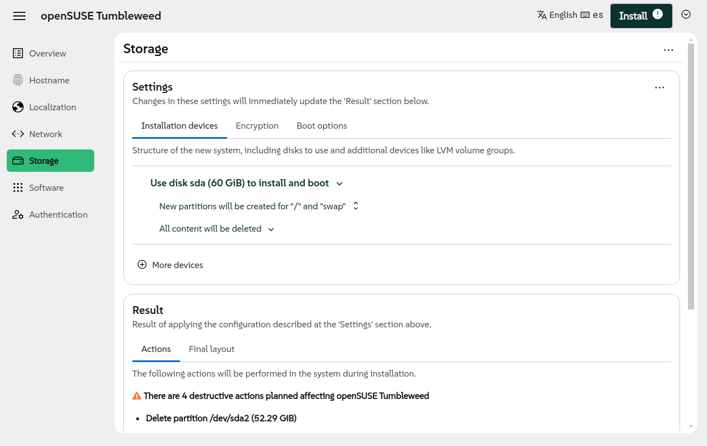
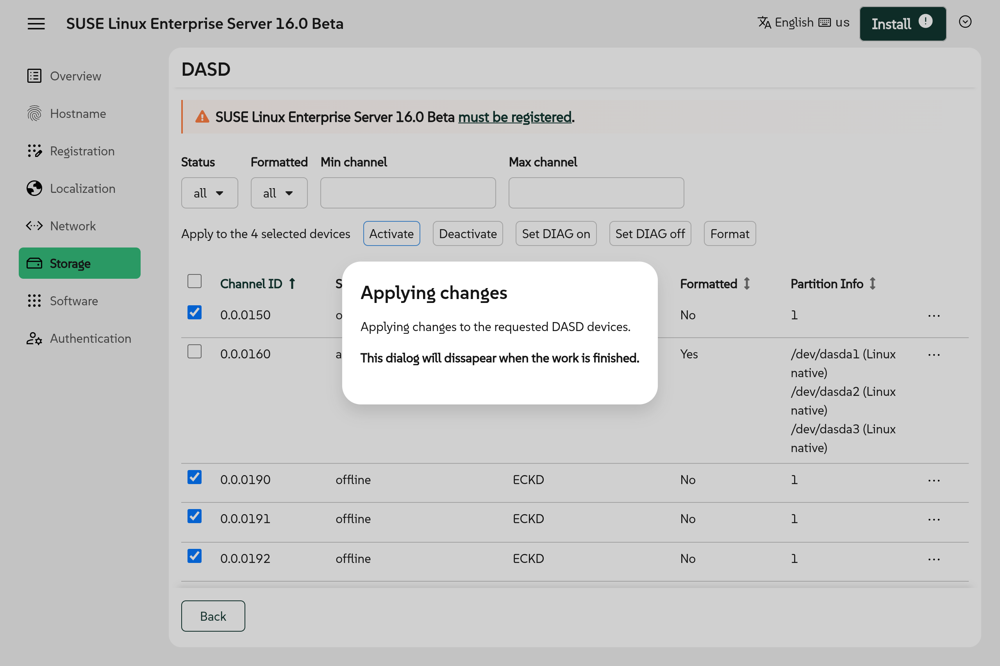

Almost three months has passed since our previous blog post, but that does not mean Agama
development has stalled. The team is actually working on two parallel lines. On the one hand we are
working to revamp several Agama internals and to greatly improve its HTTP API. On the other hand we
keep implementing several small improvements and fixes on top of the codebase of Agama 17, to the
point it deserves a new version number. So please welcome Agama 18.

{/* truncate */}

This new version delivers several features that you may experience if you install SUSE Linux
Enterprise 16.0 or Leap 16.0 using Agama, since the official installation media for those two
distributions include an intermediate version between Agama 17 and 18.

But let's take a look to the whole set of new features, starting with the changes introduced in the
user interface.

## Rearranged information in the storage section {#storage-ui}

The most potentially complex part of the web interface is the storage configuration page. Due to its
flexibility and the variety of options it offers, we are in constant search for the best way to
present the information there. Agama 18 is our latest step in that journey.

The ultimate goal is to offer a more self-explanatory interface that allows newbies to understand
what is going to happen to their disks, while making it possible for expert users to find the
advanced options they need. See more information about the changes in the following [pull
request](https://github.com/agama-project/agama/pull/2767).

## Enhanced interface to manage DASD devices {#dasd-ui}

Storage management can even be more challenging for users of System/390 mainframes. Even before
tweaking the configuration in the already mentioned storage page, they usually need to manage the
DASD devices in order to activate and maybe format the disks that will be configured.

Agama's web interface to handle those DASD devices was greatly improved in version 18, allowing to
work with a big number of devices in a more convenient way.

Not many of our readers have access to a S/390 system, but you can still get a very good overview
of the new page thanks to the many screenshots available at the description of the corresponding
[pull request](https://github.com/agama-project/agama/pull/2648).

## Improvements when using the JSON configuration {#unattended}

As most of our readers know, the web interface is just one of the possible ways to manage the
installation. The full potential of Agama can be unleashed by describing the configuration using
JSON (or Jsonnet), like it is done in the unattended installation process.

Agama 18 introduces several improvements in the way the configuration can be specified and managed,
but we would like to highlight three headlines in that regard.

 - Ability to validate a JSON profile locally, with no Agama instance running.
 - Support to manage answers to Agama questions directly in the profile.
 - Possibility to add and remove patterns to install, in addition to replacing the full list.

The [starter guide](/docs/overview) and the [documentation page](/docs/user) offer more information
about how to use the power of JSON to get the most out of Agama.

## Installer self-update functionality {#self-update}

As you may know, YaST has the ability to update itself at the beginning of the installation process
getting an up-to-date version of the installer and the installation media from a special dedicated
repository. That feature debuted at SUSE Linux Enterprise 12 SP2 and, of course, we don't want to
loose it in SLE 16.X.

The SLE 16 family will also offer self-update repositories and the Agama installation media is now
able to use them to update the installation environment very early in the process.

## Hello SLE 16.1 {#sle161}

SUSE Linux Enterprise 16 is almost ready to be served. But the activity never ceases at the Open
Source kitchen and the first ingredients of SLE 16.1 are already being selected and mixed. Any
serious cook knows that tasting the intermediate steps is key to reach the desired result at the
end. For that purpose, Agama 18 already offers the possibility to install the early alpha versions
of SLE 16.1 and surely openSUSE Leap 16.1 will follow shortly.

## See you soon, Kalpa {#kalpa}
    
But not everything are good news about the list of distributions supported by Agama. Recently the
development team behind openSUSE Kalpa [contacted
us](https://github.com/agama-project/agama/issues/2832) to clarify they have no desire nor intention
to support Kalpa installations with advanced custom partitioning schemas, like the ones that can be
achieved using Agama.

When installing openSUSE Kalpa, they would like the Agama storage page to be reduced to a single
disk selector in which the distribution would be installed as a single partition. Since there is
currently no way for the distributions to configure the Agama web interface in that way, it was
decided to remove openSUSE Kalpa from the list of distributions installable with Agama (so-called
"products" in Agama jargon).

We hope this is not a definitive farewell since, as you can see in [Agama's
Roadmap](/about/roadmap), we plan to improve support for transactional distributions in the mid-term
future.

## Officially dropped support for i586 {#i586}

And talking about future, in order to submit Agama 18 to openSUSE Tumbleweed we had to exclude the
i586 architecture. Unfortunately, there are several other parts of Tumbleweed that are not built
for such a 32bit architecture, starting with Mozilla Firefox or Chromium. Now we have followed the
same path, so it can be said that with Agama 18 we officially dropped support for i586.

We are not against re-enabling the builds for that architecture, but someone would need to create an
alternate version of the installation media that can be built with software included in the i586
version of Tumbleweed (which excludes SUSE Connect and Mozilla Firefox). In the short team, the
Agama development team has no human resources to invest on that front.

## Working in the future {#conclusion}

As mentioned at the beginning of this post, the Agama team is actively working on a big revamp of
several internals and a new version of the HTTP API that should be the cornerstone for any future
development. As you can see in the [roadmap](/about/roadmap), that new version will keep us busy for
several months. As a side effect, we expect very little activity in this blog in the short term.

Of course you can always reach us at the [Agama project at
GitHub](https://github.com/agama-project/agama) and our `#yast` channel at
[Libera.chat](https://libera.chat/).

Don't forget to have a lot of fun!
