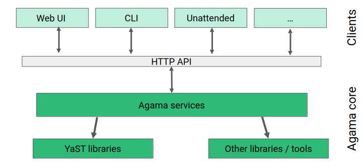
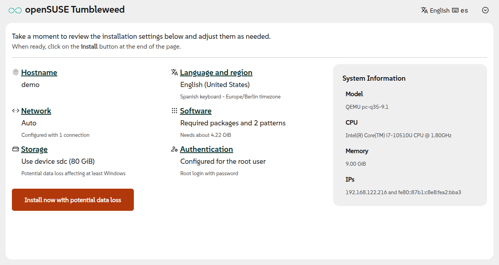
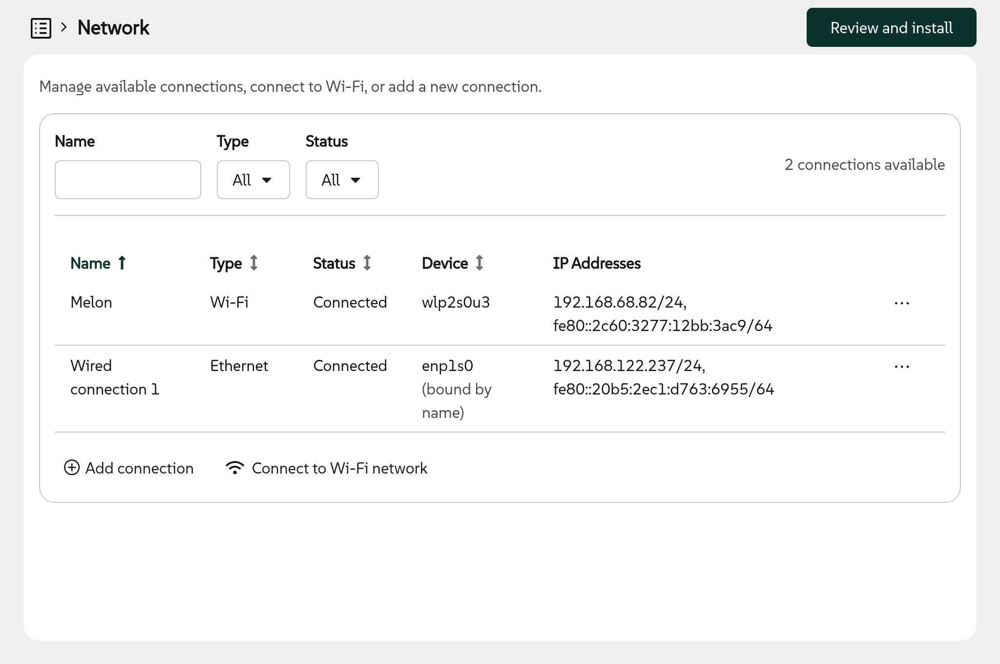
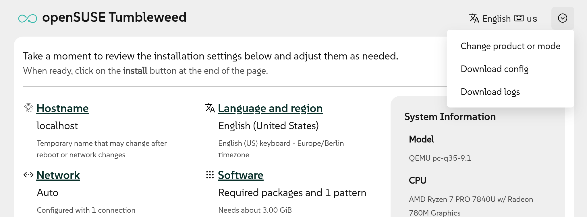
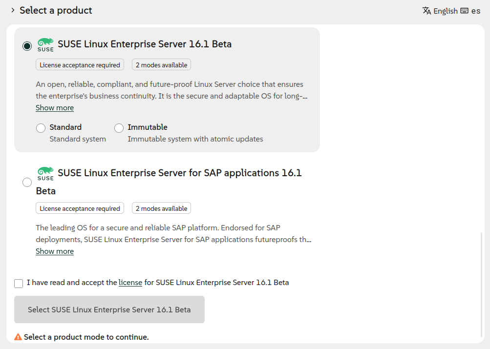

In our [previous post](2025-11-17-agama-18.mdx) from November 2025 we already told you to expect a
temporal slow down in this blog activity. And here we are, more than four months later, to finally
break that hiatus by announcing a new Agama version. But, why did it take so long to go from
Agama 18 to Agama 19?

{/* truncate */}

The key is that Agama 19 is not just another incremental change. This new version of Agama actually
represents a new starting point in several aspects, from the architectural design to the
organization of the web user interface, including some rewritten components and much more.

## Architectural revamp {#architecture}

We always wanted Agama to follow the schema displayed below, in which the core of the installer
could be controlled through a consistent and simple programming interface (an API, in developers
jargon). In that schema, the web-based user interface, the command-line tools and the unattended
installation are built on top of that generic API.

But previous versions of Agama were full of quirks that didn't allow us to define an API that
would match our quality standards as a solid foundation to build a simple but comprehensive
installer. Agama 19 represents a quite significant architectural overhaul, needed to leave all those
quirks behind and to define mechanisms that can be the cornerstone for any future development.

Of course, such a drastic change opens the door for potential bugs. Your testing, feedback and kind
bug reports will help us to consolidate the new mechanisms in upcoming Agama versions.

Note that, despite the redesign of the programming interface, the JSON-based configuration format
remains fully backwards compatible. Any JSON or Jsonnet profile that worked in previous versions of
Agama will keep working in Agama 19 and beyond.

In a similar way, we also expect to declare the Agama API as stable soon. So anyone could then
write their own tools to directly interact with the Agama core, without depending on the web user
interface or the Agama command-line tools.

## Reorganization of the web user interface {#webui}

Having a better API enabled us to adjust the web user interface to be closer to our original vision.
We still have a long way to go in our road to a fully usable interface but the new navigation
experience, based on a better overview page and a more useful confirmation dialog, sets the direction
to follow.

Although most configuration sections remain similar to previous versions of Agama, we plan to revamp
some of them. The process has already started for the sections to configure iSCSI, DASD, zFCP and
network.

Regarding network, there are two important changes. On the one hand, now the user interface
dynamicaly reacts to changes in the underlying system. For instance, when a new cable is plugged in
or when a new WiFi adapter is connected. On the other hand, now it is possible to define new
ethernet connections. That is very relevant in installation scenarios with several network adapters
that need to be configured in different ways. For example, where one network is used to access
storage devices and another one is used to reach the installation repositories.

The web user interface also got a new option to download the current installer configuration in the
JSON format used by the Agama command line tools and by unattended installation. That is the first
step to turn the web interface into a useful learning and prototyping tool for more advanced
scenarios, although this new functionality could benefit from several usability improvements. Stay
tuned.

All the mentioned changes in the user interface will require several updates to the screenshots and
guides available at the [project home page](/). That will not happen overnight, so please bear with
us during that gradual process. Of course, the page is (just like Agama itself) maintained in a
[public repository](https://github.com/agama-project/agama-project.github.io/), so feel free to
contribute to speed the process up.

## Rewritten internal components {#rewrite}

As you may know, YaST still lives in the core of Agama. Many tasks like managing storage devices or
configuring the boot loader are done under the hood by the corresponding YaST modules
(ie. yast2-storage-ng or yast2-bootloader). But lately the usage of some particular YaST modules
became more a limiting factor than an advantage.

That is the case for yast2-users and yast2-software. Both are very complex due to historical reasons
and to their ability to both install a new system and administer an already installed one, something
that is out of the scope of Agama.

Thus, we decided to use the architectural revamp as an opportunity to replace those YaST parts with
simpler implementations that will allow us to evolve faster in the future. Agama 19 includes its own
management of users and, even more important and ambitious, its own management of software including
the registration of SUSE Linux Enterprise and associated products and extensions.

## Installation modes {#modes}

But Agama 19 does not only bring restructuring and rewrites, it also comes with a bunch of new
functionality, like the new ability to install some distributions in different so-called
installation modes.

When installing the experimental pre-releases of SLES 16.1 or the corresponding version of SLES for
SAP Applications, now it is possible to select between the Standard and the Immutable modes. See the
following screenshot for details.

Agama support for installation modes is not limited to use case illustrated above. Other
distributions ("products" in Agama jargon) like openSUSE Leap or Tumbleweed may make use of modes in
the future to redefine their software and storage configurations, offering different variants of a
same operating system.

## More configuration options {#backend}

Although modes are the most visible of the new features, we also added other new capabilities to
Agama that are, at least for now, only accessible using the JSON configuration. That makes those new
features available for users of the command-line interface and of unattended installations.

Probably, the most awaited of those new features is the ability to install into an existing LVM
volume group. When doing so, it is possible to create new logical volumes within the pre-existing
volume group and it is also possible to reuse, delete or resize the existing logical volumes. Agama
19 even allows to add new physical volumes to an existing volume group as part of the process. Most
of those capabilities will soon be added to the web user interface.

We also extended the configuration of the boot loader with a new setting `updateNvram` that, when
disabled, prevents the boot loader updates of the persistent RAM (NVRAM). That is an expert feature
that was requested by several users to handle broken firmwares or network setups.

Last but not least, now it is possible to specify several SSH public keys to authenticate the root
user and also to use SSH keys as authentication mechanism for the non-root user created by Agama.

## Many changes in the installation media {#media}

As you can see, Agama 19 is quite a significant release. But there is room for many things in four
months, even to work beyond Agama itself. During this time we also incorporated several changes to
the live ISO that most of you use to execute Agama.

Those changes include several improvements in the boot menu (like better support for serial
console or adapted timeouts), dropping the "Boot from Disk" option in most architectures,
unifying the location of kernel and initramfs between the different architectures and a new boot
argument `live.net_config=1` to trigger `nmtui` (an interactive network configuration tool) before
Agama starts.

## Back to regular speed {#conclusion}

It is clear that we consider Agama 19 to be a crucial milestone in the (still short) Agama history,
but it is by no means the end of the path. Quite the opposite, we expect to recover our usual
development pace and deliver new versions almost every month, as you can see in the updated
[roadmap](/about/roadmap).

But with great software rewrites comes great opportunity for new bugs, so we depend on your bug
reports, your feedback and your contributions to keep improving. Do not hesitate to reach us at the
[Agama project at GitHub](https://github.com/agama-project/agama) and the `#yast` channel at
[Libera.chat](https://libera.chat/).

Have a lot of fun!
