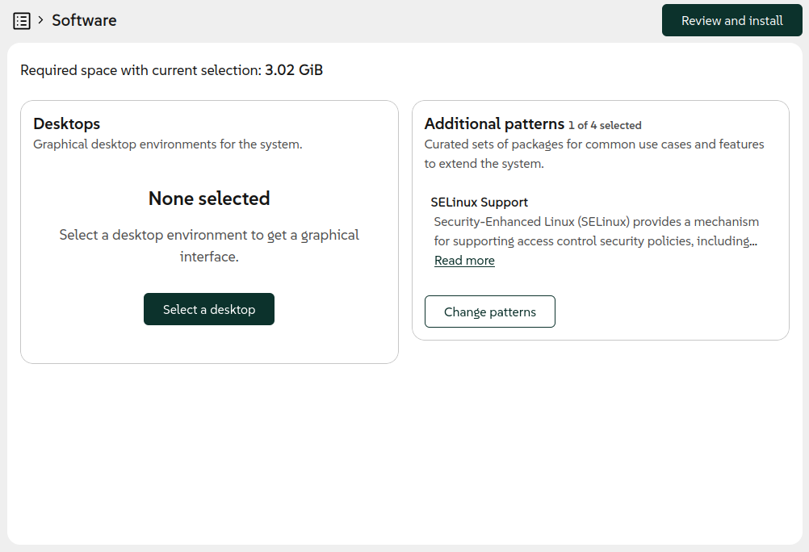
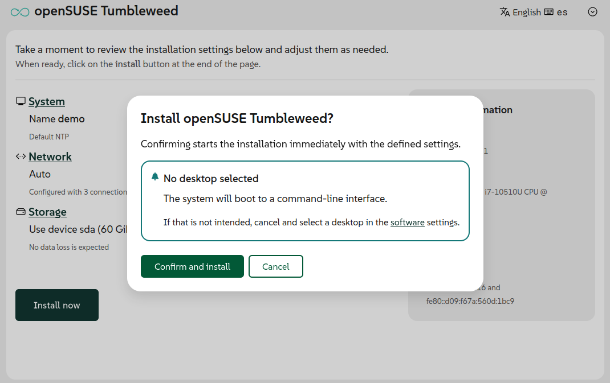
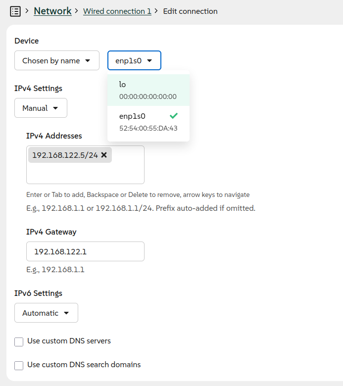
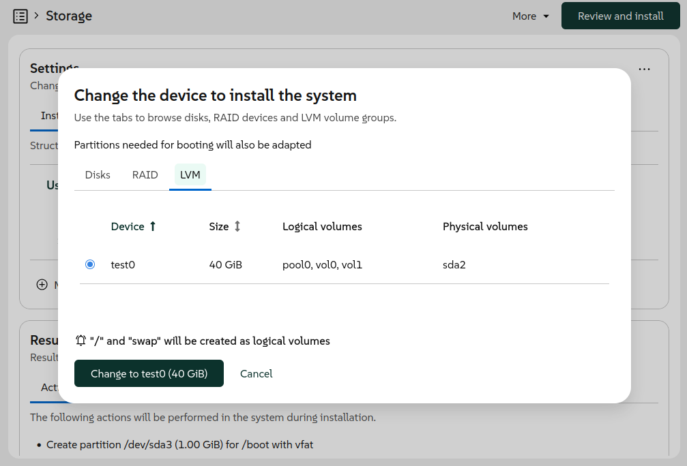
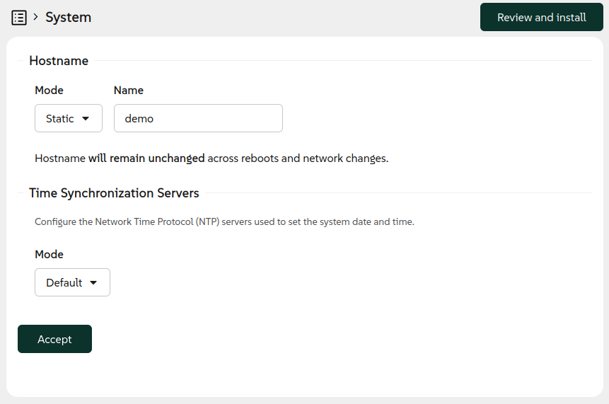

We know, we know. We skipped a blog post for version 20 and you may be wondering what happened. The
truth is that we were heads-down working on several significant improvements and decided to focus on
shipping rather than writing. But don't worry - this release announcement covers the most relevant
changes introduced in both versions 20 and 21.

{/* truncate */}

In exchange for the delay we offer you an extensive list of impressive enhancements, covering
several aspects of the installation experience and including some long-awaited features. Let's go
through the most visible novelties.

## Shedding some light on the desktops {#software}

And few things are more visible in a GNU/Linux system than its desktop environment. During
installation, most openSUSE distributions provide a wide range of desktops to select from. But
openSUSE does not endorse any of those environments as the default option. As a consequence, the
user needs to make a conscious decision during installation.

That was not obvious enough in previous versions of Agama. As a result, it was too easy to end up
installing a system with no graphical interface at all. The resulting text-based system could be
daunting for many users, especially newbies to openSUSE or GNU/Linux in general.

Now the situation is more clearly presented in the main summary screen of the installer and in the
software selection section.

We took the opportunity to rethink several aspects of the form used to select patterns. Now it works
in a way that is more consistent with the rest of the Agama interface and it presents the
information in a more useful way.

In addition to all that, a reminder about the potentially missing desktop was added in the
confirmation dialog for some distributions like openSUSE Tumbleweed, Slowroll or Leap 16.1.

## Better network management in the web UI {#network}

Usability improvements go beyond the software management. The user interface for configuring the
network also received some serious attention in these releases. The most visible result is a
completely redesigned form to create and modify network connections.

With the new form, we are now in the position to enrich the web interface with the ability to
configure more types of connections, in addition to Ethernet and Wi-Fi. In previous releases, it was
necessary to use the JSON-based Agama configuration format in order to setup a network bonding, a
bridge or a VLAN connection. With Agama 21 it is now possible to configure a bonding or bridge
connection directly from the user interface. As usual, Agama offers reasonable default settings for
each kind of connection but it also allows to setup several advanced aspects manually.

Support for VLAN connections is on its way and will be included in the upcoming version of the Agama
web interface. Hopefully these new features will fulfill the wishes of those users who have been
requesting a more powerful user interface to configure the network.

## Install on an existing LVM setup {#lvm}

But if there is a feature that has been long awaited by some users, that is the ability to reuse
existing LVM volume groups and logical volumes. If you had an existing LVM setup on your system,
previous versions of Agama couldn't take advantage of it. Now it is possible thanks to a new feature
that, as usual, is built at two levels.

On the one hand, the JSON configuration format was expanded to support all kind of operations with
existing volume groups and logical volumes. That includes expanding the volume groups with new
physical volumes and also mounting, formatting and resizing all kind of logical volumes. It is even
possible to create new thin volumes in a reused thin pool.

On the other hand, the web user interface now allows to select an existing volume group as
destination for the installation and also as additional device to create or reuse more logical
volumes.

The user interface also makes it possible to define what to do with the current logical volumes in
the same way that it can be done for the current partitions of a disk.

## Support for Systemd-boot {#bls}

So far, Agama has always installed Grub2 as boot loader for all distributions. At least, that was
the idea, although Systemd-boot slipped through the cracks in some openSUSE Tumbleweed installations
due to changes introduced in the internals shared between YaST and Agama.

But in [EFI](https://en.wikipedia.org/wiki/UEFI) environments, it seems there is a trend among many
Linux distributions to adopt the
[UAPI Boot Loader Specification](https://uapi-group.org/specifications/specs/boot_loader_specification/).
And we do not want Agama to fall behind.

Although Grub2 is still used unconditionally in many scenarios, now every distribution ("product" in
Agama's jargon) can define which boot loader to install in some supported EFI systems. Products can
choose between Grub2, Systemd-boot or openSUSE's Grub2-BLS. In the latter two cases, Agama will
adhere to the mentioned UAPI Boot Loader Specification.

Based on the chosen boot loader, Agama automatically adapts the partitioning and uses the
corresponding methodology and tools to configure the TPM to automatically unlock encrypted devices,
if the user decided to do so.

For products that still rely on Grub2, like the beta versions of openSUSE Leap 16.1 and SUSE
Enterprise Linux Server 16.1, the user can force the usage of Systemd-boot where possible by
starting the installation with the boot argument `inst.systemd_boot_preview=1`.

## NTP configuration {#ntp}

As most of our readers surely know, the Network Time Protocol (NTP) is typically used to set the
date and time of computers through the network connection. That normally works out of the box if the
network offers access to the Internet or if the address of a local NTP server is provided as part of
the automatic network configuration (eg. using DHCP). But sometimes some manual configuration is
needed.

Agama now allows to explicitly set the list of NTP sources (pools, servers and peers) using the JSON
format. It also supports automatic conversion from the corresponding `ntp-client` section of an
AutoYaST profile. Last but not least, the web interface now offers a new "System" section
accommodating the configuration of both the hostname and the NTP sources.

But there is an important aspect to consider. In order to establish secure network connections, the
date and time must be aligned with the date and time of the other system and all the involved
certificates. For network-based installations, in which secure connections may be needed already in
order to fetch the installation media, that implies the NTP configuration must happen at a very
early stage of the booting process. For that, the installation media now supports the special
[boot argument](https://agama-project.github.io/docs/user/reference/boot_options) `rd.ntp` that
allows to setup the NTP sources.

Agama will take care to persist to the installed system any setting configured through Agama itself
or by using the `rd.ntp` boot option.

## Restrict network access to the installer {#remote}

Speaking of installations and network, you already know that by default Agama allows to
control the installation process over the network from another computer or mobile device. But that
is a feature that could come with security implications in some scenarios.

Now it is possible to disable the remote access with the `inst.remote=0` boot option. When used, the
installer can be accessed only locally from the machine being installed.

## Usability improvements in the command-line tools {#cli}

Apart from all the mentioned new installer features, the command-line interface also received
several enhancements to make it more useful for tracking the current state of the installation
process. Whether you are automating installations or just prefer working from the terminal, the
improved CLI tools provide better visibility into what Agama is doing at any given moment. These
improvements make it easier to monitor installations, debug issues and integrate Agama into your
existing automation workflows.

## More to come {#conclusion}

As you can see, we have not been idle lately. After these two feature-packed releases we are
planning to shift our focus a bit more toward stabilization and polish. That doesn't mean
development is slowing down, though! We still plan to release Agama 22 in about a month, and it will
include some cool new features alongside the stability improvements.

As always, we appreciate your feedback and contributions. You can reach the YaST team at the
[YaST Development mailing list](https://lists.opensuse.org/archives/list/yast-devel@lists.opensuse.org/),
our `#yast` channel at [Libera.chat](https://libera.chat/) or the
[Agama project at GitHub](https://github.com/agama-project/agama).

Have a lot of fun!
