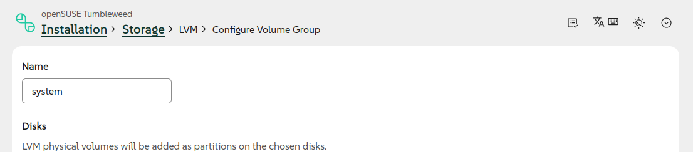
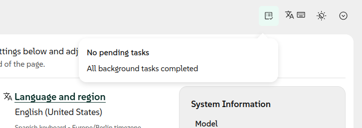
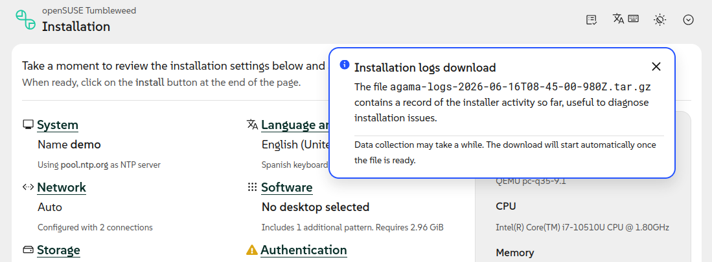
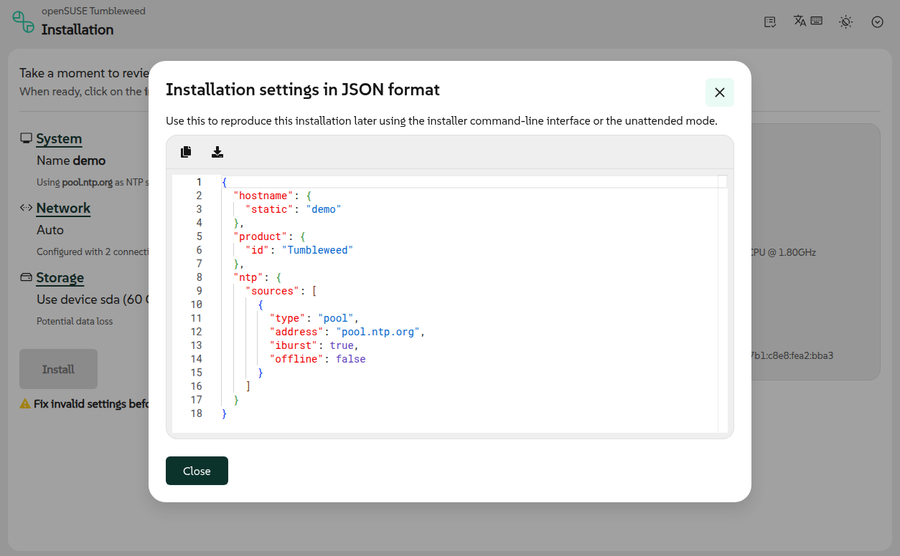
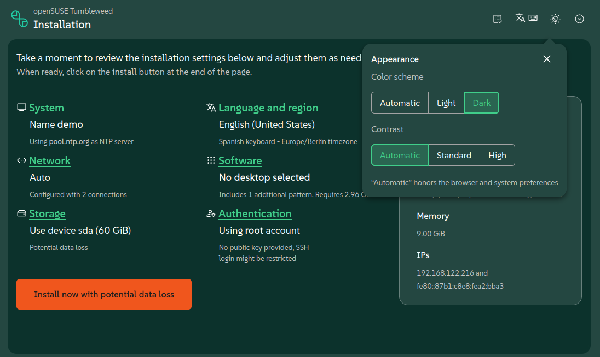
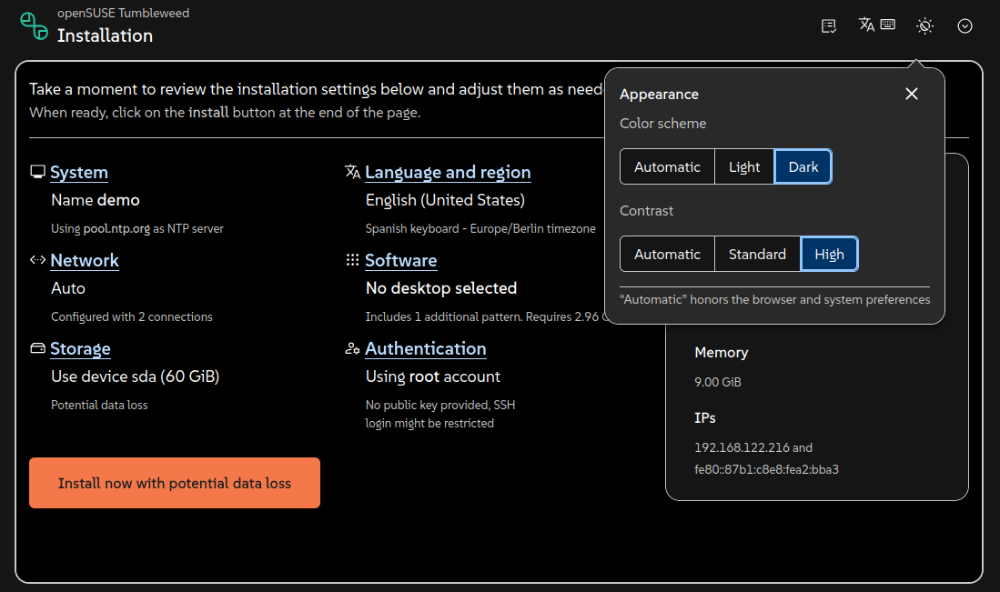
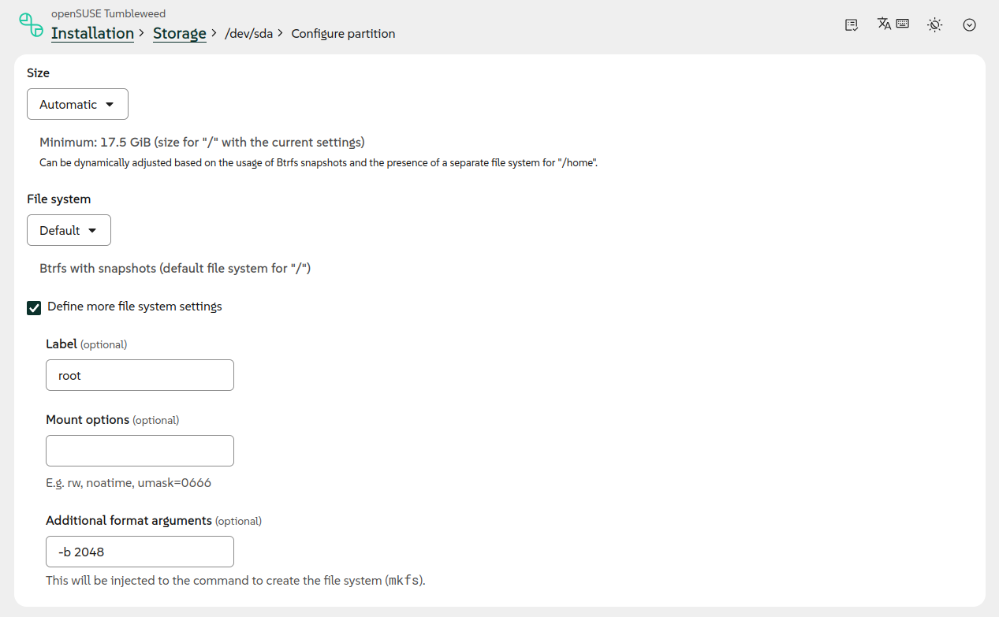
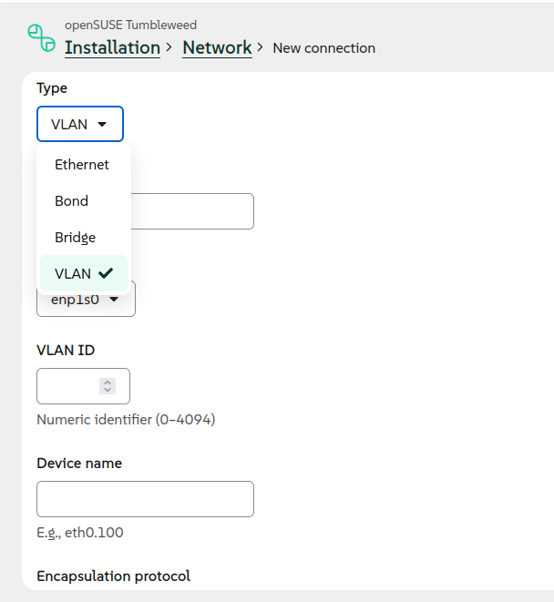
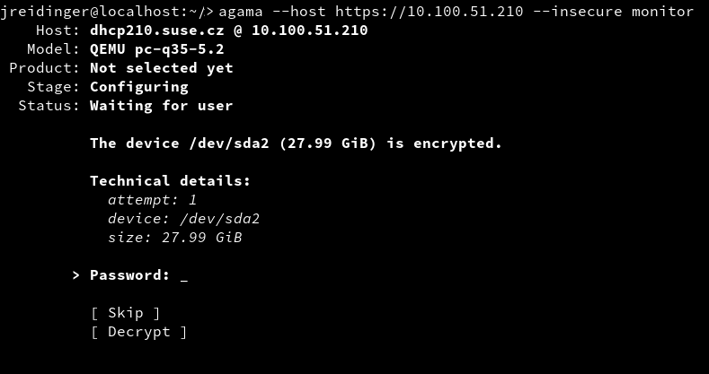

Summertime is arriving to Europe. But we all know summer does not officially start until we have had
the chance to meet and share our passion for open source at the annual
[openSUSE Conference](https://events.opensuse.org/conferences/oSC26). And since we do not want to
show up to the party empty-handed, we just finished cooking Agama 22.

{/* truncate */}

As anticipated on the [previous blog post](2026-05-21-agama-21.mdx), in this new version we focused
our efforts on polishing the user experience.

## Redesigned header and toolbar {#header}

And if there was something in need of polishing, that was the header of the web interface which, as
detailed in the description of
[this pull request](https://github.com/agama-project/agama/pull/3607), presented several problems.
Fortunately, that pull request also brought a better design that greatly improves usability.

The new design displays the product and its logo on every page, alongside a revamped set of
breadcrumbs that ease navigation. The redundant and confusing "Review and install" button is gone
and that space is now used to expose the installer tools in a more ubiquitous way.

Apart from becoming more visible, the mentioned installer tools also received usability
improvements. The progress monitor that used to be displayed only when some tasks were in progress
is now always present, making it more understandable.

The option to download the installation logs now offer more information about its purpose and about
the status of the process to gather and download the data.

In the same direction, the former "Download config" menu entry became a new "Show configuration"
tool, way more informative than just spitting a JSON file to the user.

All those small changes help to shed some light on several tools that have been there for some time
already, but that were not properly explained by previous versions of the user interface.

## Configurable appearance {#themes}

But if you look closely at the reorganized toolbar, in addition to the mentioned improved tools you
will also find the brand new "Appearance" tool, allowing to set the contrast and the combination of
colors.

That new functionality is built on the amazing accessibility work poured by the PatternFly team into
[their recent 6.5 release](https://www.patternfly.org/releases/release-highlights#patternfly-6.5).
Our dark and light schemas ride on their design tokens and take advantage of their high-contrast
mode that meets the enhanced [WCAG AAA](https://www.w3.org/WAI/WCAG2AAA-Conformance) contrast
ratios.

The new Agama dark scheme wears [SUSE's brand colors](https://brand.suse.com/design-language#color),
by default, but now every product can rebrand both the light and dark schemas end to end by
customizing a
[handful of tokens](https://github.com/agama-project/agama/blob/master/web/src/assets/products/example.css).
Customization of the high contrast mode is deliberately more restricted to make sure a rebrand can't
undo the accessibility work PatternFly put into keeping that mode WCAG AAA compliant.

## Configuration of file systems {#storage}

Improvements in usability sometimes come hand in hand with new functionality, and the other way
around. In the case of Agama 22, we wanted to add some extra controls to the web interface making it
possible to define some advanced settings for file systems. We took that as an opportunity to
revisit the corresponding sections to setup disks, partitions and logical volumes.

Apart from offering the extra file system settings shown in the previous image, the mentioned
sections are now more consistent with the rest of the Agama web interface and easier to understand
and to use.

## Setting up VLANs through the web interface {#vlan}

In the previous blog post we literally said that support for configuring VLAN connections in the web
UI was "on its way". Now the wait is over.

As you can see, now it is possible to use the graphical user interface to setup all kind of network
connections including Wi-Fi, Ethernet, bridge, bond and of course VLAN.

## Improvements in the command-line interface {#cli}

But, as you know, the graphical web interface is not the only way to interact with the installation
process. Agama 22 also brings enhancements for those users preferring the command line.

The most visible change is that the text-based monitor now allows to answer the installer questions
interactively.

Since several commands like `agama config load` rely on the monitor to display the result of their
operations, all those commands automatically benefit from this new feature.

We also took the opportunity to unify the behavior and the messages displayed by several components
of Agama, like the mentioned monitor, the `agama status` command and the web interface.

Putting all that together with all the changes in the web UI already mentioned on this blog post, we
are certain that Agama 22 is the most usable and accessible release to this date.

## Configure access to the installed system {#access}

But usability may go beyond the user interface itself and may include aspects like making common
tasks as simple and direct as possible. In that regard we detected that many users of unattended
installation were struggling to setup all the needed aspects to make sure the system was accessible
for administrative purposes right after the installation process was over.

Agama now includes a new `access` section in its JSON configuration that allows to setup all the
related aspects on the installed system. Just follow
[the documented syntax](/docs/user/reference/profile/access) to indicate whether you want to access
the new system via SSH or Cockpit and Agama will take care of enabling the service, opening the port
in the firewall and any extra adjustment that may be needed.

## See you at the openSUSE Conference {#conclusion}

As mentioned at the beginning, some of the Agama developers plan to be around for the openSUSE
Conference. But we will only be able to be there during Thursday afternoon and Friday early morning,
so do not hesitate to bump into us at any chance.

Nevertheless, you know you can reach to us at any time via the
[YaST Development mailing list](https://lists.opensuse.org/archives/list/yast-devel@lists.opensuse.org/),
our `#yast` channel at [Libera.chat](https://libera.chat/) or the
[Agama project at GitHub](https://github.com/agama-project/agama).

See you soon!
