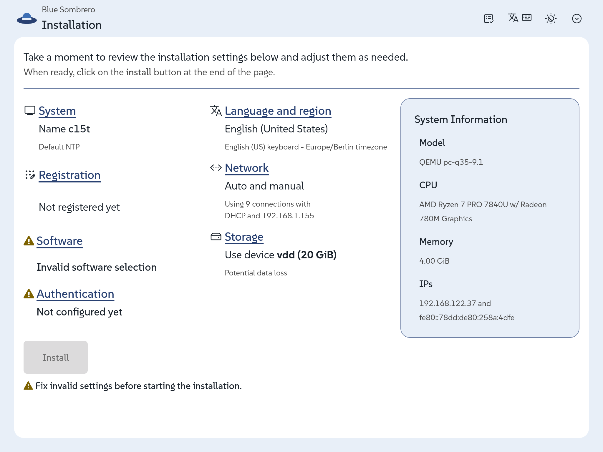
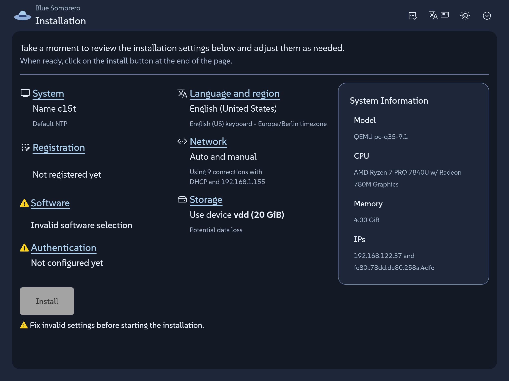

The [announcement of Agama 22](2026-06-16-agama-22.mdx) described some of the novelties regarding
the visual appearance and contained a sentence you may have overlooked. Along with new functionality
like the dark mode, it came the machinery that lets any distribution ("product" in Agama's jargon)
restyle the whole installer without touching a single line of Agama code. If you always wanted Agama
to look a bit more like your favorite distribution, keep reading.

{/* truncate */}

Customizing the Agama appearance is as easy as dropping in the right directories a single CSS file
named after your product id and the corresponding logos. That is it. The installer picks that up and
wears your colors, your logo, your typography and other styles. Including light and dark scheme and
with the accessibility floor kept intact.

Describing that takes a paragraph, and we just spent it. So instead of describing it further, let's
see it in action in two fully fictional scenarios.

## A tale of two distros {#examples}

Meet Lucie, a contributor to a Linux distribution that uses a color palette based on a nice shade of
light blue and that is somehow related to another distribution that uses a nice hat as logo. Of
course, any resemblance to reality is pure coincidence. :wink:

Lucie wants to see how an Agama-based installation could look for her beloved distribution. One
afternoon, she spends a few minutes creating a simple skin that defines the primary colors.



Then she realizes she also needs to adapt those colors for the dark scheme.



And that is. No need to define typeface, sizes, corners, etc. All of that stays at Agama's values,
which still results in a quite nice installer that looks as a fully coherent product. Agama ships no
product skin on its own, so Lucie's CSS file is not overriding anything; it is filling a gap that
was intentional left for each product.

Now meet Charles. He develops his own respin of openSUSE Leap just for fun and he wants to see how
far he can go in customizing Agama to his very own personal taste. What about some '80s vibe with
big phosphor green letters on charcoal, a pixel typeface, every corner square, and a prompt caret
for a logo?


That is exactly how Charles envisioned the dark mode. But a proper skin also needs to take care of
the light scheme. So after adjusting some colors he also comes with the following combination.


Two products, one shared set of customizable visual roles, and not a line of Agama code touched.

## Learn how to do it {#learn}

The work that matters happens before the CSS file is written: choosing the colors, deciding what
each scheme should look like, checking that every pair actually reads on screen. Once those
decisions exist, putting them in is the short part... no matter whether you are Lucie setting a few
roles or Charles configuring every possible one.

But what "role" means in this context? A product stylesheet sets only properties named
`--agm-t--something`. Those are the so-called roles, named after what they mean in an installer: the
brand color, the page surface, the danger status, the focus ring.

```css
/* Light theme. */
:root:where(:not(.pf-v6-theme-dark)) {
  --agm-t--brand--color: #3c6eb4;
  --agm-t--brand--text--color: #fff;
  --agm-t--link--color: #294172;
  --agm-t--surface--color--raised: #e8eff8;
  --agm-t--status--danger--color: #c42366;
}
```

There are relatively few roles to set, which is actually a very intentional feature. Instead of
customizing any occurrence of a certain color in the UI, just say once "this is my brand color" and
buttons, toggles, progress bars, selected rows and focus rings follow along.

All that is explained in the
[theming guide](https://github.com/agama-project/agama/blob/master/doc/product_theming.md), that
comes along with two ready-to-copy examples similar to the ones described above and even with a
draft AI prompt in case you want to outsource the fun.

Then you only need to add a your logos, stylesheet and eventually fonts to the installer medium.
Those files travel to the medium in your own package, which is the part we like best: your branding
stays in your repository, versioned with the rest of your distribution, and ships on your schedule
rather than waiting for an Agama release. The
[packaging guide](https://github.com/agama-project/agama/blob/master/doc/product_theming_packaging.md)
walks through it. It also includes a few things you may want to know, like how to make your
installer start in dark mode or how to preview the result without packaging anything by just copying
two files into a running installer (eg. over `scp`) and reloading the browser.

## Have a lot of fun {#conclusion}

We know that regular users do not usually create their own installable distributions, so the
audience of this blog post may be a bit more restricted than those posts announcing new Agama
versions. Nevertheless, we welcome any feedback including any personal exercise just for fun!

Meanwhile we will keep working on improving several aspects of the installer. As usual you can reach
out to us at the `#yast` channel at [Libera.chat](https://libera.chat/) or the
[Agama project at GitHub](https://github.com/agama-project/agama).
