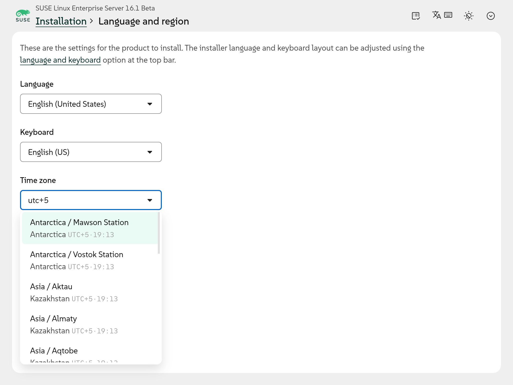
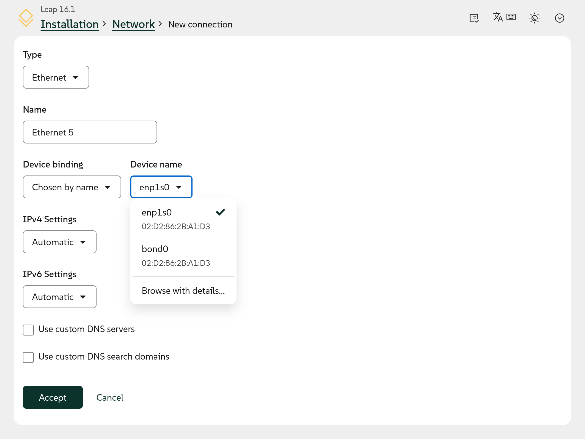

Yes, we know: version 23 came and went without a blog post. As it has happened before, we were busy
enough with several tasks and blogging fell down the priority list. So consider this a two-for-one
announcement covering the most relevant changes introduced in both Agama 23 and Agama 24.

{/* truncate */}

But do not expect a long list of shiny new features. During the last months the team poured most of
its energy into testing, polishing and fixing corner cases, so this post is a bit more modest than
usual. Still, there are a few improvements worth highlighting.

## Better interface to configure language and region {#i18n}

Configuring the internationalization settings -language, keyboard layout and time zone- in previous
versions of the web user interface used to require jumping into three separate full-page selectors.
Those three settings now live together in a single form, each one as a searchable field that filters
the available options as you type.

The matching is accent-insensitive, so typing "ingles" finds "Inglés". The time zone selector even
shows the current local time and UTC offset for each entry. A single "Accept" button applies all the
changes at once, saving a couple of round trips in the process.

## Binding network connections to their devices {#network}

Agama offers the possibility to configure several network connections. Some of those network
connections can be associated to a specific network adapter, but telling several similar devices
apart used to be tricky when the interface only offered their names and MAC addresses. The web UI
now includes a "Browse with details..." option that opens a sortable table listing each device along
with its type, IP addresses and connection state, so you can pick the right one with confidence.

In addition, other small improvements regarding the binding of network connections and devices were
implemented here and there.

## More usability and accessibility improvements {#webui}

Beyond the changes already mentioned, this stabilization phase brought a long tail of smaller
usability and accessibility refinements scattered across the whole web interface: better keyboard
navigation, more consistent forms, clearer wording, improved screen reader support and many other
little touches. There are far too many to list here, but together they make the installer noticeably
more pleasant to use.

## More theming capabilities {#theming}

And things are especially pleasant when they feel consistent and in-place. To achieve that, every
distribution can restyle the whole installer as explained in our
[previous blog post about theming Agama](2026-08-11-dressed-for-success.mdx). Those styling
capabilities keep growing: recent versions expanded the set of customizable roles and refined how
the light, dark and high-contrast schemes are handled, giving products even more freedom to make
Agama look like their own.

## More possibilities to select storage devices {#search}

But the recent Agama improvements go beyond the web user interface. When using JSON to configure the
installation, for example in an unattended installation profile, it is often important to define how
each individual disk or partition must be processed. That requires a reliable way to identify the
devices in the system and to match them against the definitions in the JSON configuration. As you
may know, that is done using a `search` section within each of those definitions.

We recently made those `search` sections much more expressive. In addition to the logical operators
`and`, `or` and `not` to combine and nest conditions, it is now possible to match devices by their
kernel driver, by their filesystem (type, label or simply whether they are formatted), by the ID
type of a partition and even by the number and content of partitions or logical volumes within a
disk or LVM volume group. That allows queries as specific as "the smallest of those NVMe disks that
are bigger than 100 GiB and contain an ext4 partition".

## Improved AutoYaST compatibility {#autoyast}

Talking about unattended installations, one of the key features of Agama is its ability to consume
AutoYaST profiles. Agama reads those profiles and automatically converts them into its own
configuration, which is then processed as usual. The latest versions improve that conversion for the
network configuration and also handle errors more gracefully while processing AutoYaST profiles,
resulting in a more intuitive user experience if some feature is not fully supported by Agama.

## More to come {#conclusion}

With this stabilization phase behind us, the team is eager to switch back into a more innovative
mode. So we hope the next release will bring a bunch of more exciting features to write about. Stay
tuned!

Meanwhile, if you want a closer look at the development of Agama and wish to help shaping its
future, you can take a look at the [project at GitHub](https://github.com/agama-project/agama) or
drop by the `#yast` channel at [Libera.chat](https://libera.chat/).
