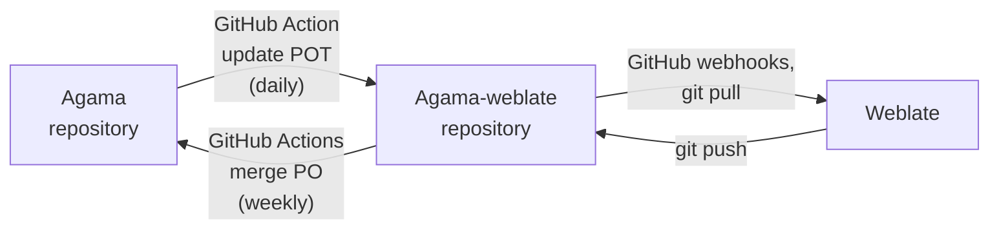

# Internationalization (i18n)

Internationalization (sometimes abbreviated as "i18n") is a process for supporting different
languages and locales in software. This page describes how is that handled in Agama.

Each component need to solve this problem separately, see more details for each part in the details
below.

## Using translations

Users have two ways how to change the used language in the Agama interface.

### Language selector

The sidebar of the web UI contains a component that allows to change the language. It was introduced
in Agama 5 and it is the recommended way. The list of supported languages is read from the
[languages.json](https://github.com/agama-project/agama/blob/master/web/src/languages.json) file.
Check the [The web front-end](#the-web-front-end) for further details.

### URL query parameter

When using a remote installation it is possible to set the used language via an URL query parameter.
This is an expert option.

To change the language append the `?lang=<locale>` query to the URL when accessing the Agama
installer. The `locale` string uses the [RFC 5646](https://www.rfc-editor.org/rfc/rfc5646.html) but
the usual Linux locale format is supported too, e.g. `cs_CZ`.

It is the user responsibility to use a correct locale name. When using a wrong name the translations
might be broken, displayed only partially or even not at all.

Changing the language causes reloading the page, in some situations this could cause losing some
entered values on the current page. Therefore it is recommended to change the language at the very
beginning.

## Translations

For translation process Agama uses [Weblate](https://weblate.org/) tool running at the
[openSUSE](https://l10n.opensuse.org/) instance.

## The workflow

The basic translation workflow looks like this:

1. The translatable texts are marked for translation in the source code, usually with the `_()`
   function or something similar
2. The translatable string are collected into a POT file which is uploaded to the staging
   [agama-weblate](https://github.com/agama-project/agama-weblate) GitHub repository
3. The POT file is loaded by the Weblate into the [agama](https://l10n.opensuse.org/projects/agama/)
   project
4. Translators then can translate the English texts into other languages
5. Weblate pushes back the translations in the PO files back to the
   [agama-weblate](https://github.com/agama-project/agama-weblate) repository
6. The translations in the PO files are regularly copied to the main repository using pull requests
7. The PO files are processed during build so the translations can be used later at runtime

## Staging translation repository

The special [agama-weblate](https://github.com/agama-project/agama-weblate) repository works like a
buffer between the Agama sources and the Weblate tool.

The overall schema is like this:



We do not want to spam the Weblate tool with every trivial change in the texts and the other way
round, we do not need to get dozen commits from the Weblate every day with updated translations.
This would be especially annoying before releasing a new version where we might want to accept only
unnecessary changes to not break something at the very last minute.

The agama-weblate repository uses webhooks to notify the Weblate instance of any change. Changes in
the repository should be visible in Weblate in matter of seconds.

## Synchronization

The content between the main [agama](https://github.com/agama-project/agama) and the translation
[agama-weblate](https://github.com/agama-project/agama-weblate) GitHub repositories is synchronized
automatically using the GitHub Actions.

### Uploading translatable texts

Collecting and uploading the translatable texts is done by the
[weblate-update-pot.yml](https://github.com/agama-project/agama/blob/master/.github/workflows/weblate-update-pot.yml)
GitHub action.

- It checks out both `agama` and `agama-weblate` repositories
- Different components use different commands for building each POT file
  - The web frontend runs the
    [build_pot](https://github.com/agama-project/agama/blob/master/web/build_pot) script
  - The product definitions use the
    [products_pot](https://github.com/agama-project/agama/blob/master/.github/workflows/product_translations/products_pot)
    script
  - The Ruby services call `rake pot`, the usual way for extracting texts in YaST
- The new or updated texts from the POT file are merged to the translated PO files using the
  `msgmerge` tool. This ensures that the new or updated texts can be translated at Weblate.
- The updated POT and PO files are then copied to the `agama-weblate` checkout and committed to
  GitHub. If there is no change in the files besides the timestamps then the file
  it is not uploaded to `agama-weblate`.

This action is run daily, but it can be started manually if needed. Go to the
[weblate-update-pot.yml](https://github.com/agama-project/agama/actions/workflows/weblate-update-pot.yml)
action detail and use the "Run workflow" option at the top of the page.

### Downloading updated translations

The translations from the `agama-weblate` repository are merged back by several GitHub actions.

- Product translations:
  [weblate-merge-products-po.yml](https://github.com/agama-project/agama/blob/master/.github/workflows/weblate-merge-products-po.yml)
  - Runs the
    [merge_po](https://github.com/agama-project/agama/blob/master/.github/workflows/product_translations/merge_po)
    script which injects the translations from the PO files into the product
    YAML files.
- Frontend translations:
  [weblate-merge-po.yml](https://github.com/agama-project/agama/blob/master/.github/workflows/weblate-merge-po.yml)
  - Updates the `languages.json` file with the list of supported languages depending on the
    translation coverage
  - Builds the `po.<language>.js` file with the translations converted to JavaScript format
- Backend translations:
  [weblate-merge-service-po.yml](https://github.com/agama-project/agama/blob/master/.github/workflows/weblate-merge-service-po.yml)
  - Just copies the PO files to the `service/po` directory

These actions run automatically once a week, but they can be triggered manually from the
[actions](https://github.com/agama-project/agama/actions) page.

## Weblate configuration

The [Agama Weblate](https://l10n.opensuse.org/projects/agama/) project defines a separate
translation component for each Agama part (the web front-end, the Ruby D-Bus back-end and product
definitions).

For reading the translations it uses the
[agama-weblate](https://github.com/agama-project/agama-weblate) GitHub repository, but for the
source code locations it uses the original [agama](https://github.com/agama-project/agama)
repository. That means after clicking the source location link in the Weblate you will see the
correct source code location in the original repository.

## Technical details

This part describes technical and implementation details. It also describes the translation process
for developers.

### The web front-end

Most of the translatable texts which can user see in Agama are defined in the web front-end.
However, the web front-end can display some translated texts coming from the back-end part so it is
important to set the same language in both parts and make sure the translations are available there.

The list of supported languages is read from the
[languages.json](https://github.com/agama-project/agama/blob/master/web/src/languages.json).
Such a list is automatically refreshed when any of the PO files is updated (see
[Uploading Translatable Texts](#uploading-translatable-texts)).

The [update-manifest.py
script](https://github.com/agama-project/agama/blob/master/web/share/update-manifest.py) is the
responsible for updating the list of supported languages. It goes through all PO files, filters out
the ones with less than 70% of translated content and adds the corresponding locales to the
`languages.json`.

The name of the locale is taken from [langtable](https://pypi.org/project/langtable/), so be sure to
have it installed. However, when the territory is not include in the PO file (`es` instead of
`es_es`), the script uses the [locales.json
map](https://github.com/agama-project/agama/blob/master/web/share/locales.json) to determine which
territory to use.

If you need to manually update the `languages.json` file, run:

```shell
web/share/update-languages.py --po-directory ../agama-weblate/web > web/src/languages.json
```

The `--po-directory` option points to the
[agama-weblate](https://github.com/agama-project/agama-weblate) repository
checkout. You have to clone it manually, in the Agama checkout root directory run command:

```shell
git clone git@github.com:agama-project/agama-weblate.git ../agama-weblate
```

### Marking texts for translation

The texts are marked for translation using the usual functions like `_()`, `n_()` and others. It is
similar to the GNU gettext style.

The mechanism of loading and displaying the translation is heavily inspired in Cockpit's approach.
The [i18n module](https://github.com/agama-project/agama/blob/master/web/src/i18n.js) offers a set of
translation functions:

```js
import { _, n_, N_, Nn_ } from "~/i18n";
```

It is important to use these functions only on string literals! Do not use them with string
templates or string concatenation, that will not work properly.

The `_` and `n_` functions can be used on variables or constants, but their content must marked for
translation using the `N_` or `Nn_` functions on string literals. See the examples below.

#### Singular Form

This is the most common way:

```js
const title = _("Storage");
```

For using translated text in React components you need to use curly braces to switch to plain
Javascript in the attributes and the content:

```js
<Section title={_("Storage")}></Section>
```

or

```js
<Button>{_("Select")}</Button>
```

For translating long texts you might use multiline string literals:

```js
const description = _(
  "Select the device for installing the system. All the \
file systems will be created on the selected device.",
);
```

If you need to insert some values into the text you should use the [formatting
function](#formatting-texts). It is recommended to use [translator comments](#translators-comments)
for short or ambiguous texts.

#### Plural form

If the translated text contains a number or quantity it is good to use a plural form so the
translated texts looks naturally.

```js
sprintf(
  // the first argument is a singular form used when errors.length === 1,
  // the second argument is used in all other cases
  n_("%d error found", "%d errors found", errors.length),
  errors.length,
);
```

Although the English language has only a single plural form the translators can use more of them.
The translation definition also defines a function that computes which plural form to use for a
specific number. See more details about the [plural
forms](https://www.gnu.org/software/gettext/manual/html_node/Plural-forms.html) in the GNU gettext
documentation.

#### Translating constants

The top-level constants are evaluated too early, at that time the translations are not available yet
and the language is not set.

The constant value must be marked with `N_()` function which does nothing and then later translated
with the usual `_()` function.

```js
const LABELS = Object.freeze({
  auto: N_("Auto"),
  fixed: N_("Fixed"),
  range: N_("Range")
});

export default function Foo() {
  ...
  <label>{_(LABELS[value])}</label>
```

#### Formatting texts

For formatting complex texts use the C-like `sprintf()` function.

```js
import { sprintf } from "sprintf-js";

sprintf(_("User %s will be created"), user);
```

See the [sprintf-js](https://www.npmjs.com/package/sprintf-js) documentation for more details about
the formatting specifiers.

_Note: You cannot use HTML tags in the translated texts, React automatically escapes all special
HTML characters like `<>&`. That is different to YaST where we can use HTML tags in rich text
messages._

It is recommended to avoid building texts from several parts translated separately. This is error
prone because the translators will not see the complete final text and might translate some parts
inaccurately.

```js
// do NOT use this! it is difficult to translate the parts correctly
// so they build a nice text after merging
return <div>{_("User ")}<b>{user}</b>{_(" will be created")}</div>

// rather translate a complete text and then split it into parts
// TRANSLATORS: %s will be replaced by the user name
const [msg1, msg2] = _("User %s will be created").split("%s");
...
return <div>{msg1}<b>{user}</b>{msg2}</div>
```

Text splitting might be quite complex in some cases, but still should be preferred.

```js
// TRANSLATORS: error message, the text in square brackets [] is a clickable link
const [msgStart, msgLink, msgEnd] = _("An error occurred. \
Check the [details] for more information.").split(/[[\]]/);
...
return <p>{msgStart}<a>{msgLink}</a>{msgEnd}</p>;
```

Building sentences from separate parts might be easy in English, but is some other languages it
might much more complex. Always assume that the target language has more complex grammar and rules.

```js
// do NOT use this! it is difficult to translate "enabled" and "not enabled"
// differently in the target language!
const msgNot = enabled ? "" : _("not");
sprintf(_("Service is %s enabled"), msgNot);

// this is better
enabled ? _("Service is enabled") : _("Service is disabled");
```

#### TRANSLATORS comments

You can use a special `TRANSLATORS` keyword in the comment preceding the text marked for
translation. All comments after the keyword are included in the translations file, this should help
the translator to correctly translate the text.

```js
// this line is NOT included in the PO file
// TRANSLATORS: this line is included in the PO file,
// this line as well
_("Back");
```

The translators comments should be used especially for short texts to better describe the meaning
and the context of the message.

```js
// TRANSLATORS: button label, going back to the main page
_("Back");
```

Also the formatting placeholders should be always described.

```js
// TRANSLATORS: %s will be replaced by the user name
_("User %s will be created");
```

The JSX code does not support comments natively, you have to write them in curly braces.

```js
<Button>
  {/* TRANSLATORS: button label */}
  {_("Remove")}
</Button>
```

But in the component attributes you can use usual Javascript comments.

```js
<TextInput
  id="port"
  name="port"
  value={data.port || ""}
  // TRANSLATORS: network port number
  label={_("Port")}
/>
```

### Changing argument order in translations

The translators can change the order of the arguments in formatted text using additional positional
argument `%<pos>$<format>` where `pos` is the index of the argument and `format` is the usual type
formatting tag, like `s` for a string.

For example to change the order of the arguments in English text `"Foo %s %s"` it can be translated
as `"Bar %2$s %1$s"`.

### Missing translations

Here are some code examples which might look correct at the first sight. They even work, no crash.
But there are still translation problems with them.

- Do not use Javascript string templates, that does not work at all (~~``_(`User ${user} will be
created`)``~~), use a string formatting function for that (`sprintf(_("User %s will be created"),
user)`).

- Use the translation functions only with string literals without any operators, texts like
  ~~`_("foo" + "bar")`~~ will not be extracted correctly to the POT file.

In both cases the strings will not be extracted to the POT file.

### ESLint plug-in

There is a special ESLint plug-in
[eslint-plugin-agama-i18n](https://github.com/agama-project/eslint-plugin-agama-i18n) which ensures
that only a string literal is passed to the translation functions. This should avoid the problems
with [missing translations](#missing-translations) mentioned above.

### Testing language

The Agama web interface supports special testing `xx` language. That language needs to be selected
manually by adding the `?lang=xx` query string to the server URL. With this setting the `_()` and
`n_()` translation functions replace all alphabetical characters by the `x` symbol.

This can be used for testing to find out the texts which are not marked for translation. If a text
is not replaced by the `x` symbols then either it is not marked for translation or it comes from the
back-end and it should be translated by the back-end.

However, this is not perfect. It will replace also the texts mentioned in the [missing
translations](#missing-translations) section above but in reality the there would be no translations
available for them.

### Loading web UI translations

The translations are loaded dynamically by using the `import()` call. This loads the
`po-<language>.js` file at runtime which exports the translation mapping object.

### Back-end locale

The Agama server exposes a `uiLocale` configuration option via the `/api/l10n/locales/config`
endpoint which defines the locale used by all the services.

The `uiLocale` property is a single global value shared by all connected clients. That means it is
possible to use only one language for all clients, if more users connect to the server and uses a
different UI language then there will be race conditions and the other users might see the texts
coming from the back-end in another language than expected.

This is a known limitation, we expect that only one user at a time will access the Agama installer
or if multiple users use the same server we expect that they will be from the same team or company
using the same language.

To check or set the locale you can use the `/api/l10n/locales/config` endpoint. Alternatively, you
can check (but not change) the current locale via D-Bus:

```shell
sudo busctl --address unix:path=/run/agama/bus get-property org.opensuse.Agama1 \
/org/opensuse/Agama1/Locale org.opensuse.Agama1.Locale UILocale
```

#### Back-end translations

The back-end might return texts from external components like `libstorage-ng`. Make sure the
translations for those components are also available for Agama, e.g. the `libstorage-ng`
translations are stored in the `libstorage-ng-lang` package or the YaST translations are stored in
`yast2-trans-<LANG>` packages.

## Troubleshooting

Here are some hints what to do when some untranslated text appears in the Agama UI.

1. Check that the text is marked for translation, for a quick verification you might try setting the
   [testing language](#testing-language).
2. If the text comes from back-end or the other parts check that the appropriate [language
   package](#back-end-translations) is installed.
3. The text should be [extracted into the POT file](#building-the-pot-file)
4. The [agama.pot](https://github.com/agama-project/agama-weblate/blob/master/web/agama.pot) in the
   `agama-weblate` repository is up to date, if not then run the [Weblate Update
   POT](https://github.com/agama-project/agama/actions/workflows/weblate-update-pot.yml) Github Action
   manually. The same applies for the product and service POT files.
5. The text is translated in the [Weblate repository](https://l10n.opensuse.org/projects/agama/).
6. The translation is included in the respective PO file in the
   [agama-weblate](https://github.com/agama-project/agama-weblate) repository.
7. The translation files in the
   [web/src/po](https://github.com/agama-project/agama/tree/master/web/src/po) directory are up to
   date, if not the check whether there is an [open pull
   request](https://github.com/agama-project/agama/pulls?q=is%3Aopen+is%3Apr+label%3Atranslations+label%3Abot)
   with the change, if yes then check it and merge, if not then run the [Weblate Merge
   PO](https://github.com/agama-project/agama/actions/workflows/weblate-merge-po.yml) GitHub Action
   manually, then check the created pull request. For the product translations and the service
   backend translations run the appropriate GitHub Action.
8. The translated string should be present in the built packages, run `npm build` command and check
   the `dist/po-*.js` files, check the built RPM package.
9. The translations are loaded by the browser, check the content loaded for the `po-*.js` files.
10. Check the current language used in the browser, check the `agamaLang` cookie value (run
    `document.cookie` command in the console).
11. Check the language used by the [Back-end locale](#back-end-locale).
